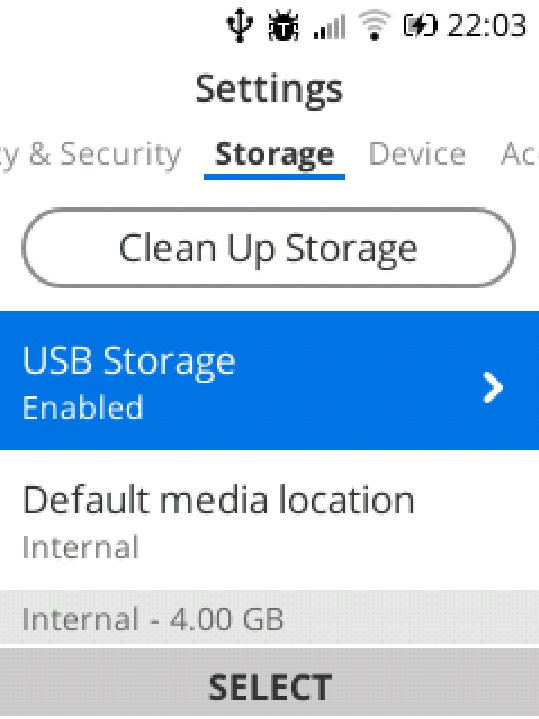
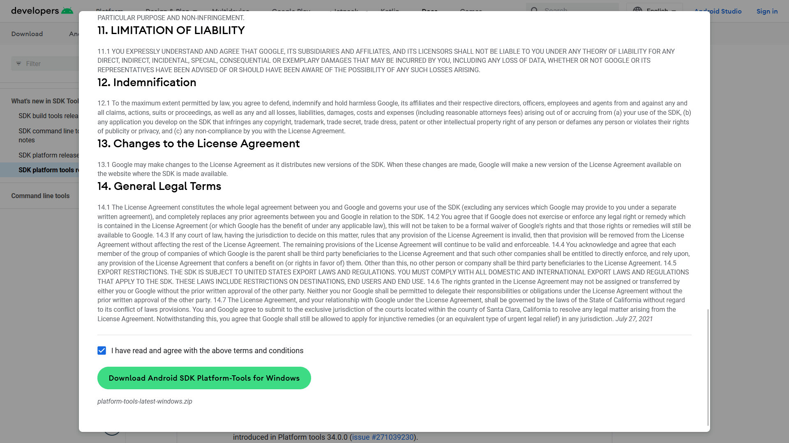
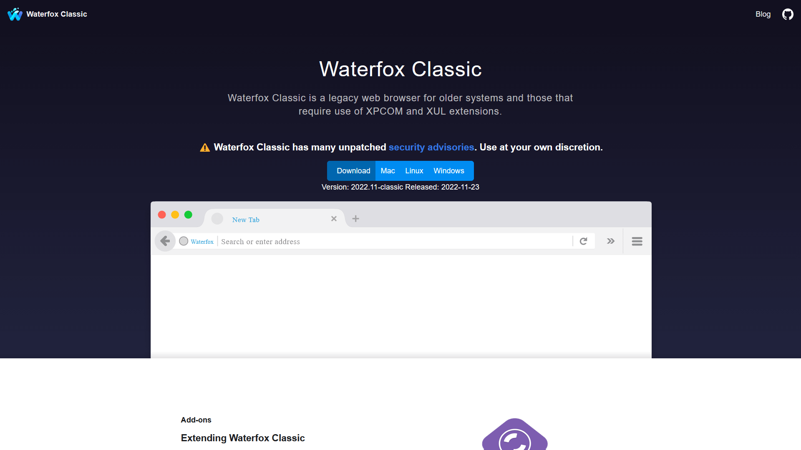
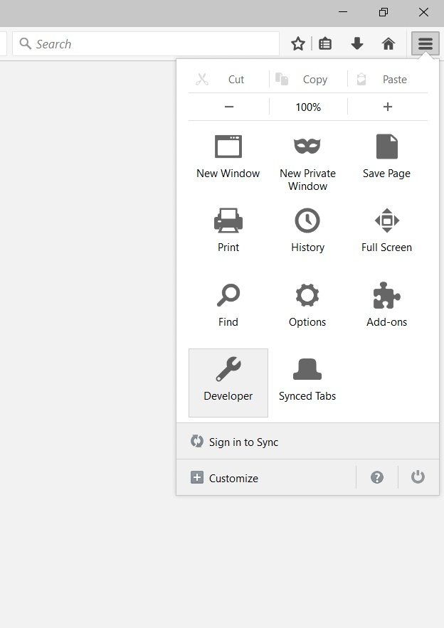
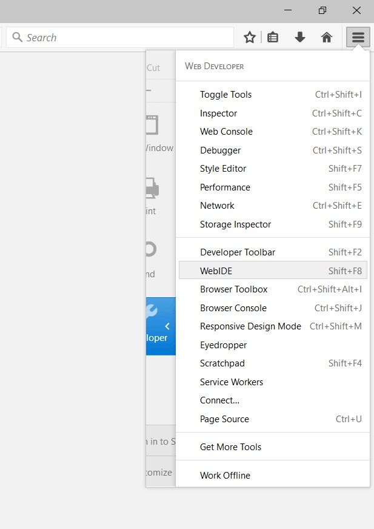
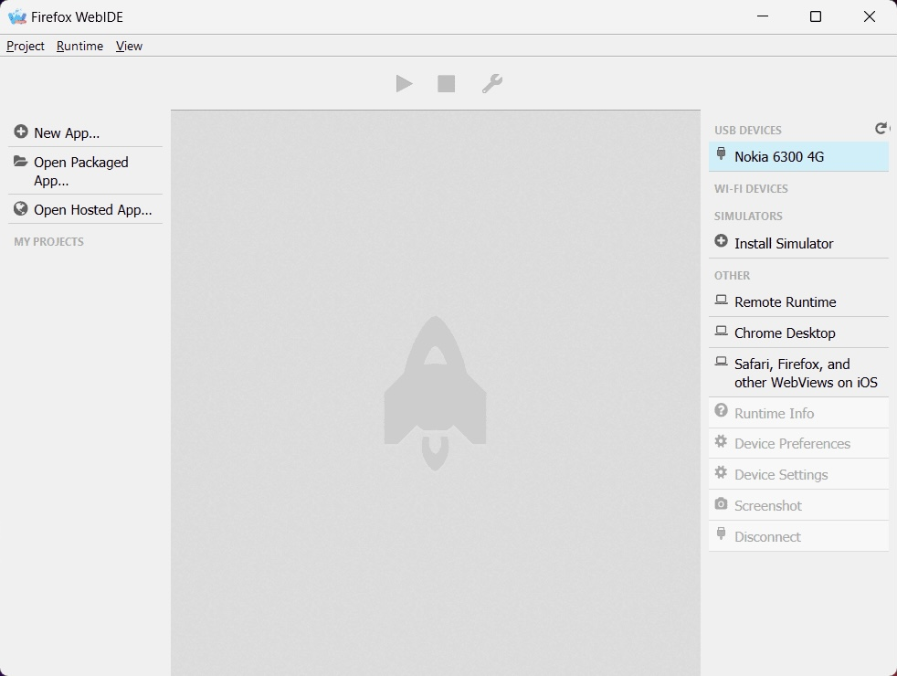
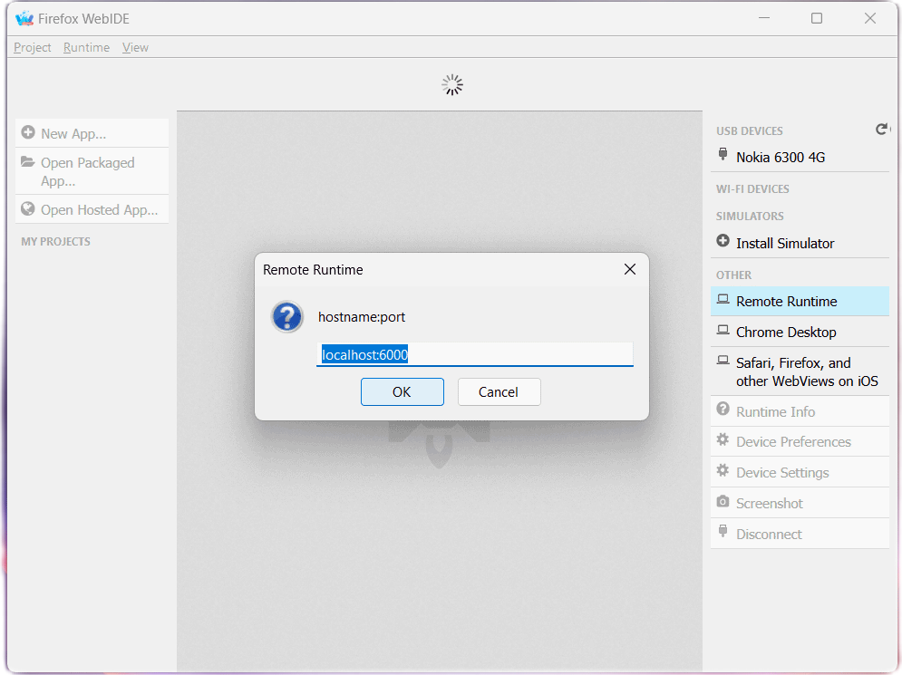
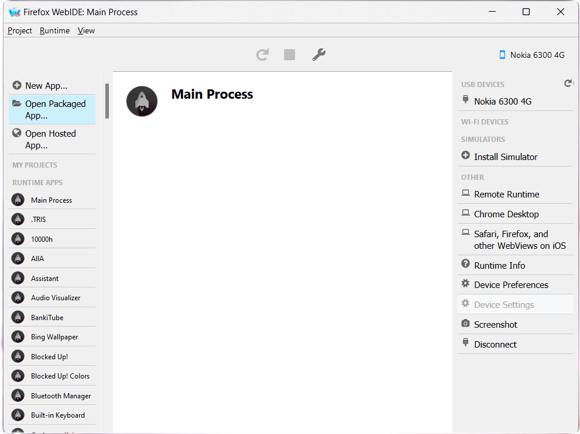
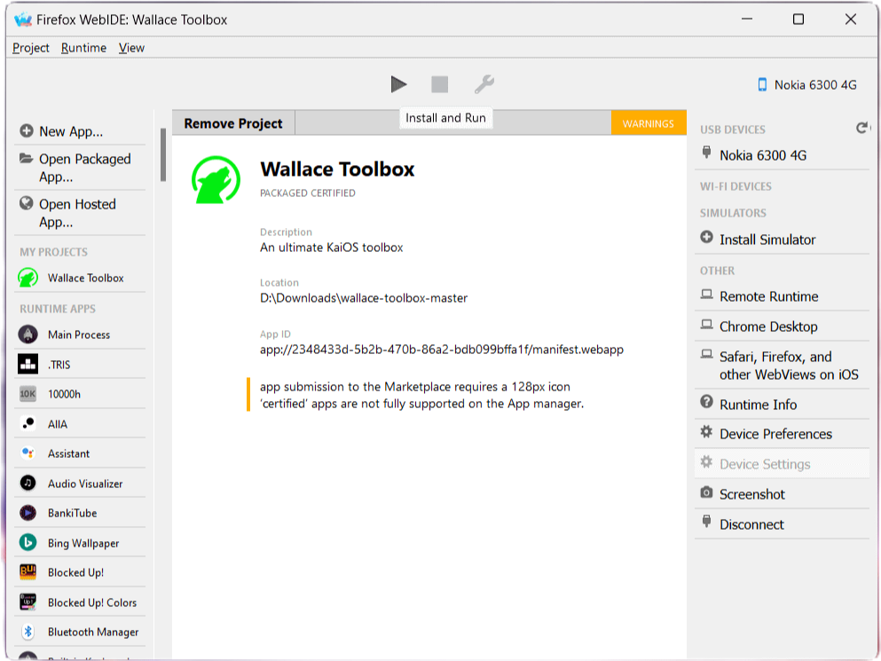

# ADB and WebIDE
{:.no_toc}

Table of Contents
{:.text-delta}
- TOC
{:toc}

{:.warning}
> KaiOS 2.5 only. To sideload apps on debug-enabled KaiOS 3 devices, follow the instructions on using KaiOS's in-house `appscmd` on [the official Developer Portal](https://developer.kaiostech.com/docs/sfp-3.0/getting-started/env-setup/os-env-setup).

According to [How-To Geek](https://www.howtogeek.com/773639/what-is-sideloading-and-should-you-do-it), sideloading is 'the practice of installing software on a device without using the approved app store or software distribution channel'. This can be useful if you want to use an app that is either not eligible for distributing over KaiStore, not available in your region, or if you want to test an app that you are developing.

This is where Android Debug Bridge (ADB) and WebIDE come in. Inherited from the now-defunct Firefox OS, WebIDE allows you to manage installed applications and configurations on KaiOS phones. It works by communicating with a specific port on your phone over ADB, an internal protocol for engineers usually found on Android devices.

Before you ask: no, despite using Android compatibility layer for hardware support, KaiOS isn't Android and cannot run APKs. It uses Gecko the browser engine for rendering apps, and they typically come in the form of ZIP archive files, which consists of HTML, styling and JavaScript code for functionality.

## Sideloading 101
### What we'll need
- a computer with command-line tool installed: Command Prompt on Windows, Terminal on macOS/Linux
- [a debug-enabled phone running KaiOS 2.5]()
- an USB cable with data transferring
- an Internet connection to download tools and navigate to W2D (optional if there are debug codes)
- an archive extractor installed to extract our tools:
  - on macOS/Linux, use Finder, built-in file manager or `unzip`;
  - on Windows, use [7-Zip](https://www.7-zip.org) or WinRAR if you prefer
- [Android Developers' SDK Platform Tools](https://developer.android.com/tools/releases/platform-tools) or install ADB via your package manager (we'll guide you below)
- [Waterfox Classic](https://classic.waterfox.net): most up-to-date pre-Photon fork of Firefox with WebIDE
- most importantly, computer skills and patience

*Need a video tutorial? If you're on Linux, KaiOS Technologies officially made one for their own WebIDE client KaiOSRT which can be found [here](https://www.youtube.com/watch?v=wI-HW2cLrew). Alternatively, there's also one on BananaHackers' YouTube channel [here](https://www.youtube.com/watch?v=SoKD7IBTvM4).*

### Turn on debugging mode on your phone
1. Check whether your phone can be debugged and any special notes to follow on the [Devices page]().
   - Some may have specific codes that can be dialed from the home screen to quickly activate debugging mode, i.e. `*#*#33284#*#*` for Nokia devices and both `*#*#33284#*#*` and `*#*#0574#*#*` for Energizers and others. More details of this can be found on each device page.
2. Navigate to https://w2d.bananahackers.net using default Browser on the phone. Use D-Pad keys to move the cursor and click on the big front <kbd>Launch Developer menu</kbd> button.
3. In the newly opened Developer menu, select the first <kbd>Debugger</kbd> option, then <kbd>ADB and DevTools</kbd> from the dropdown menu. You should see a bug icon in the status bar letting you know ~~your phone has bugs inside~~ you're in debugging mode.


{:style="counter-reset:none"}
4. If you're connecting to a Linux-based PC, you may need to go to Settings, Storage and turn on <kbd>USB Storage</kbd> for `udev` to properly register your phone as an USB peripheral. An icon in the status bar will appear indicating storage access via USB.



{:style="counter-reset:none"}
5. Connect the phone to your computer with the USB cable.

### Download and set up ADB
> Now, if your operating system has a package manager, you can utilize that to quickly install and set up ADB:
> * Windows: `choco install adb` 
> (`winget` unfortunately [prohibits installing executables with symlinks](https://github.com/microsoft/winget-pkgs/issues/4082))
> * macOS: `brew install android-platform-tools`
> * Linux (Debian/Ubuntu): `sudo apt-get install adb fastboot`
> * Linux (Fedora): `sudo dnf install android-tools`
> * Linux (Arch): `sudo pacman -S android-tools`
> 
> Skip to next part when you're done.

{:style="counter-reset:none"}
6. On your computer, visit [Android Developers' SDK Platform Tools](https://developer.android.com/tools/releases/platform-tools) website and click on the link correspond to your operating system under the Downloads section. Read the terms if you want to, tick the box and click the green button to have the SDK downloaded to your computer.




{:style="counter-reset:none"}
7. Extract the downloaded archive to a folder (double-click the file on macOS/Linux, 7-Zip > <kbd>Extract here</kbd> on Windows), navigate to its `platform-tools` root and open a command-line window by that directory.
8. Type `adb devices` to start the ADB binary server. ADB will automatically detect all devices with active debugging mode connected to the computer over USB. If a `device` shows, you're good to go! Otherwise, go back, check if you've missed any steps or whether [your phone supports ADB]().
   - Note that if you're unable to run `adb`, you may need to make it an executable: `chmod +x ./adb`

```
$ adb devices
* daemon not running; starting now at tcp:5037
* daemon started successfully
List of devices attached
1a2b3c4d	device
```
{:style="counter-reset:none"}
9. If you prefer to use other WebIDE clients, or if you have trouble connecting later on as `adbd` fails to detect your phone, forward ADB access to TCP socket 6000 for debugging:

```
$ adb forward tcp:6000 localfilesystem:/data/local/debugger-socket
6000
```
*Tip: If you've downloaded the SDK package from Android Developers' website, for quicker access next time, include the extracted ADB folder in PATH. We won't cover this here as this would be a lengthy process. This will be automatically handled if you've installed ADB via package manager.*

<details>
  <summary>Connect to ADB over Wi-Fi</summary>
WIP
</details>

### Connect to WebIDE

{:style="counter-reset:none"}
10. We'll use [Waterfox Classic](https://classic.waterfox.net) for WebIDE (Firefox 59 and Pale Moon <28.6.1 will also do the job just fine). To download, head to the browser's homepage, download and install the version correspond to your OS.



{:style="counter-reset:none"}
11. Open Waterfox Classic and press the hamburger menu button at the right end of the toolbar, click the <kbd>Developer</kbd> entry, then click <kbd>WebIDE</kbd>.




*Tip: For quicker access to WebIDE, press its shortcut <kbd>Shift</kbd> + <kbd>F8</kbd> while you're in the browser.*

{:style="counter-reset:none"}
12. Your phone's name should appear in the right pane. Click it to connect. If you don't see any, click <kbd>Remote Runtime</kbd> in the right pane, leave it as default at `localhost:6000` and press OK. If you still cannot connect your phone to WebIDE, check if you've missed any steps or whether [your phone allows DevTools]().





*If you're using other means to access WebIDE such as Firefox v59 or Pale Moon <28.6.1, you may now see a warning header about mismatched build date. You can safely ignore it as WebIDE was mainly designed to support Firefox OS device builds released alongside that Firefox/Pale Moon versions.*

### Ready to sideload apps

{:style="counter-reset:none"}
13. To sideload an app, download it (you can find lots of great apps on [BananaHackers Store](https://store.bananahackers.net) and GitHub!) and extract its ZIP content (if you see an OmniSD-packaged `application.zip` you may need to extract that too).
14. Select <kbd>Open Packaged Apps</kbd> in WebIDE's left sidebar and navigate to the root of the app folder you just extracted.



{:style="counter-reset:none"}
15. Once you've got the app loaded, press the triangle <kbd>Install and Run</kbd> in the top bar to sideload!



> If you encounter an issue in a sideloaded app and want to debug, click the wrench to open the Developer Tools.