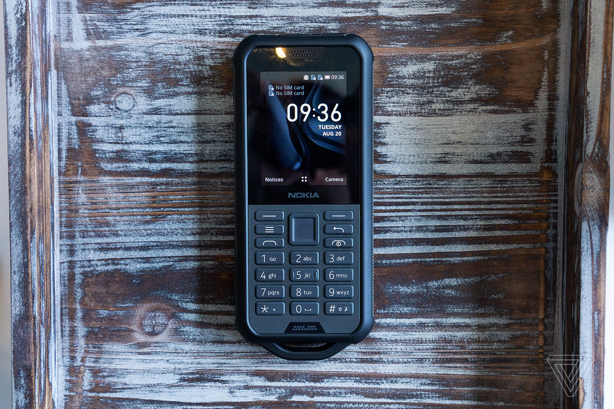

# Nokia 800 Tough (nokia-coconut)
{: .no_toc }

  
View device specification table

<table>
  <thead><tr><th colspan="2">Nokia 800 Tough (nokia-coconut)</th></tr></thead>
  <tbody>
    <tr><td>Released</td><td>5 September 2019</td></tr>
    <tr><td>Model</td><td>TA-1176, TA-1180, TA-1186, TA-1189</td></tr>
  <tr><td colspan="2">Specifications</td></tr>
    <tr><td>SoC</td><td>Qualcomm MSM8905 Snapdragon 205 (2 * 1.1GHz Cortex-A7)</td></tr>
    <tr><td>RAM</td><td>512MB LPDDR2/3</td></tr>
    <tr><td>GPU</td><td>Adreno 304</td></tr>
    <tr><td>Storage</td><td>4GB eMMC 4.5 (+ up to 32GB microSDHC card)</td></tr>
    <tr><td>Network</td><td>2G GSM, 3G UMTS, 4G LTE Cat4 150/50Mbps <em>+ EU: band 1, 3, 5, 7, 8, 20 + ROW (excl. US/LATAM): band 1, 3, 5, 7, 8, 20, 28, 38/41 (120MHz), 39, 40</em> VoLTE/VoWiFi support Single or Dual-SIM (Nano-SIM, dual-standby)</td></tr>
    <tr><td>Screen</td><td>320 * 240 @ 167 PPI 2.4 inches QVGA TFT LCD, 256K colors</td></tr>
    <tr><td>Bluetooth</td><td>4.1, A2DP, LE</td></tr>
    <tr><td>Wi-Fi</td><td>802.11b/g/n, 2.4GHz, Hotspot</td></tr>
    <tr><td>Peripherals</td><td>- GPS, GLONASS - 198 Lumen dedicated flashlight</td></tr>
    <tr><td>Cameras</td><td>Rear: 2MP, LED flash</td></tr>
    <tr><td>Dimensions (HWD)</td><td>145.4 * 62.1 * 16.1 (mm) 5.72 * 2.44 * 0.63 (in)</td></tr>
    <tr><td>Weight</td><td>161 g (5.68 oz)</td></tr>
    <tr><td>Ports</td><td>- microUSB charging &amp; USB 2.0 data transferring port - 3.5mm headphone jack</td></tr>
    <tr><td>Specials</td><td>- IP68 dustproof and water resistant (up to 1.5m for 30 minutes) - MIL-STD-810G compliant: survive up to 1.8m free fall, -20°C to +55°C</td></tr>
    <tr><td>Battery</td><td>Non-removable Li-Ion 2100mAh, 5W wired charging (up to 43 days of GSM standby advertised)</td></tr>
  <tr><td colspan="2"><strong>KaiOS info</strong></td></tr>
    <tr><td>Version</td><td>KaiOS 2.5.2, upgradable to KaiOS 2.5.2.2</td></tr>
    <tr><td>WA VoIP</td><td>Supported (30.00.17.05 onwards)</td></tr>
    <tr><td>Build no.</td><td>12.00.17.01, 21.00.17.01, 22.00.17.01, 30.00.17.05, 40.00.17.01</td></tr>
  </tbody>
</table>

