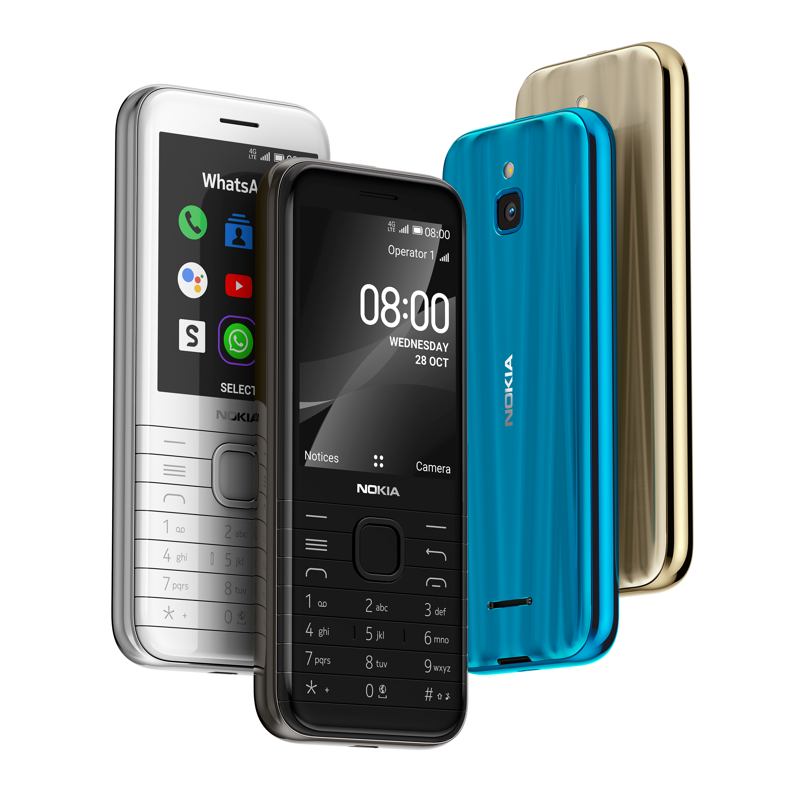

# Nokia 8000 4G (nokia-sparkler)
{: .no_toc }

  
View device specification table

<table>
  <thead><tr><th colspan="2">Nokia 8000 4G (nokia-sparkler)</th></tr></thead>
  <tbody>
    <tr><td>Released</td><td>13 November 2020</td></tr>
    <tr><td>Model</td><td>TA-1300, TA-1303, TA-1305, TA-1311</td></tr>
  <tr><td colspan="2"><strong>Specifications</strong></td></tr>
    <tr><td>SoC</td><td>Qualcomm MSM8909 Snapdragon 210 (4 x 1.1GHz Cortex-A7)</td></tr>
    <tr><td>RAM</td><td>512MB LPDDR2/3</td></tr>
    <tr><td>GPU</td><td>Adreno 304</td></tr>
    <tr><td>Storage</td><td>4GB eMMC 4.5 (+ up to 32GB microSDHC card)</td></tr>
    <tr><td>Network</td><td>2G GSM, 3G UMTS, 4G LTE Cat4 150/50Mbps <em>+ EU (except East Ukraine, Azerbaijan, Georgia), APAC: band 1, 3, 5, 7, 8, 20 + HK, Macau, MENA, CN, Nigeria, Tanzania: band 1, 3, 5, 7, 8, 20, 28, 38, 39, 40, 41 + ROW: band 1, 3, 5, 7, 8, 20, 28, 38, 40</em> VoLTE &amp; VoWiFi support Single or Dual SIM (Nano-SIM, dual-standby)</td></tr>
    <tr><td>Screen</td><td>320 x 240 @ 143 PPI 2.8 inches QVGA TFT LCD, 16M colors</td></tr>
    <tr><td>Bluetooth</td><td>4.0, A2DP, LE</td></tr>
    <tr><td>Wi-Fi</td><td>802.11b/g/n, 2.4GHz, Hotspot</td></tr>
    <tr><td>Peripherals</td><td>GPS</td></tr>
    <tr><td>Cameras</td><td>Rear: 2MP, LED flash</td></tr>
    <tr><td>Dimensions (HWD)</td><td>132.2 * 56.5 * 12.3 (mm) 5.20 * 2.22 * 0.48 (in)</td></tr>
    <tr><td>Weight</td><td>110.2 g (3.88 oz)</td></tr>
    <tr><td>Ports</td><td>- microUSB charging &amp; USB 2.0 data transferring port - 3.5mm headphone jack</td></tr>
    <tr><td>Battery</td><td>Removable Li-Ion 1500mAh (BL-4XL), 5W wired charging</td></tr>
  <tr><td colspan="2"><strong>KaiOS info</strong></td></tr>
    <tr><td>Version</td><td>KaiOS 2.5.4</td></tr>
    <tr><td>WA VoIP</td><td>Supported</td></tr>
    <tr><td>Build no.</td><td>10.00.17.01, 12.00.17.01, 20.00.17.01, 30.00.17.01</td></tr>
  </tbody>
</table>

Table of Contents
{: .text-delta }
- TOC
{:toc}

As this device is almost identical to the Nokia 6300 4G, everything you need to know about this phone, including special codes, boot modes and rooting guide are located in the [Nokia 6300 4G](https://minhduc-bui1.github.io/nokia-leo) page.

## Source code
HMD Global/Nokia Mobile has published the device's source code for its Linux 4.9 kernel, B2G and certain third-party libraries used in this phone, which can be downloaded directly from [here](https://nokiaphones-opensource.azureedge.net/download/phones/Nokia_8000_4G_20.00.17.01_OSS.tar.gz).

Note that the source code released does not contain proprietary parts from other parties like Qualcomm.

## External links
- [Nokia 8000 4G product page](https://www.nokia.com/phones/en_int/nokia-8000-4g) on Nokia Mobile's website
- [Discussion: Nokia 6300 4G and Nokia 8000 4G](https://4pda.to/forum/index.php?showtopic=1009510) on 4PDA Forum (Russian)
- [Nokia 8000 4G and Nokia 6300 4G general discussion thread](https://groups.google.com/g/bananahackers/c/jxEC3RVMYvI) on BananaHackers Google Groups
- [Nokia 8000 4G rooting research thread](https://groups.google.com/g/bananahackers/c/8lCqP15zHXg) on BananaHackers Google Groups
- [Nokia 8000 4G (nokia-sparkler)](https://wiki.postmarketos.org/wiki/Nokia_8000_4G_(nokia-sparkler)) on postmarketOS Wiki
- [Affe Null's Bananian project repository](https://git.abscue.de/bananian/bananian), a Debian port for KaiOS devices