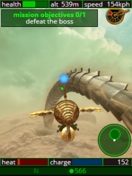

# Developer resources

  
  
<em>A gameplay screenshot from Christian Waadt's Airship Combat 3D</em>

Are you tired of the same old apps on KaiStore and BananaHackers Store? Do you have a creative idea for a KaiOS app but don’t know how to make it happen? This is the place where you can find useful documentation to help you learn how to develop apps for the platform *(thanks Bing AI!)*

Before you start developing KaiOS apps: 
- **KaiOS is an operating system that runs on web technologies**. KaiOS does not support Android apps, despite using Android HIDL for hardware compatibility. Instead, it uses a forked version of Boot-to-Gecko (B2G) from the discontinued Firefox OS as its core rendering engine. Think of it as ChromeOS on phones with physical keypad.
- As such, apps on KaiOS are built with web technologies such as HTML, CSS, and JavaScript—not native as Java or Kotlin but has similar performance—and are executed by Gecko runtime, though you can use the same tools and frameworks that you use for web development, such as React or TypeScript.
- Be wise: even though KaiOS devices are limited on hardware features as they're usually targeted towards emerging markets, especially on the amount of RAM, but if you use it smartly, they will [provide enough CPU and GPU to power your games](https://ays-arts.de/airship-combat-3d/).

## Getting started on KaiOS development
- KaiOS Technologies' [Official documentation portal](https://developer.kaiostech.com/)
- KaiOS Technologies' [List of recommended resources for developing KaiOS apps](https://www.kaiostech.com/learn-to-develop-for-the-kaios-operating-system-with-these-resources)
- [W3schools.com](https://w3schools.com/) for learning to code HTML5, CSS and JavaScript and make KaiOS apps
- [YOUR FIRST APP, a little tutorial on how a KaiOS application works](https://sites.google.com/view/bananahackers/development/your-first-app) on BananaHackers website
- farooqkz's [A not so brief introduction to KaiOS and app development for it](https://blog.bananahackers.net/farooqkz/a-not-so-brief-introduction-to-kaios-and-app-development-for-it) on BananaHackers Blog
- [KaiOS Game Development Tutorials – Complete Guide](https://gamedevacademy.org/kaios-game-development-tutorials)
- tbrrss's [KaiOS development blog](https://kaios.dev/)
- Huzaifa Arif's [KaiOS: Everything you need to know!](https://medium.com/proximity-labs/kaios-everything-you-need-to-know-383bd0c3d081) on Proximity Labs/Medium
- Nolan Lawson's [The joy and challenge of developing for KaiOS](https://nolanlawson.com/2019/09/22/the-joy-and-challenge-of-developing-for-kaios)

## API documentations
- [Archived list of B2G device APIs](https://contest-server.cs.uchicago.edu/ref/JavaScript/developer.mozilla.org/en-US/docs/Archive/B2G_OS/API.html)
- [Can I Use utility](https://caniuse.com/) to check API compatibility with v2.5 (Gecko 48.0a1) or v3 (Gecko 84)
- [KaiAds SDK implementing instructions](https://www.kaiads.com/publishers/sdk.html)

### Snippets
- Interacting with files on device storage: [delete a file](https://wiki.bananahackers.net/development/device-api/device-storage/delete-file), [rename a file](https://wiki.bananahackers.net/development/device-api/device-storage/rename-file), [create new file](https://wiki.bananahackers.net/development/device-api/device-storage/create-new-file), [list files](https://wiki.bananahackers.net/development/device-api/device-storage/list-files) and [update a file](https://wiki.bananahackers.net/development/device-api/device-storage/update-file)
- Managing user interactions of [soft-keys](https://wiki.bananahackers.net/development/keys-file) (you can [simulate those](https://wiki.bananahackers.net/development/simulate-softkeys) while testing as well)
- Creating a quick [toast](https://wiki.bananahackers.net/development/toaster) or a longer-lasting [notification](https://wiki.bananahackers.net/development/notification)
- [Getting the version number](https://wiki.bananahackers.net/development/get-version-number) so your app knows what the phone is capable of and what feature to deliver
- Get to know [mozActivity](https://wiki.bananahackers.net/development/webAcitivity-snippets) and [webActivity](https://wiki.bananahackers.net/development/webAcitivity-snippets)

## Testing your app (KaiOS 2.5)
- Include your app details in a good [manifest.webapp](https://wiki.bananahackers.net/development/manifest)
- [Martin Kaptein's guide to sideloading apps on KaiOS](https://kaptein.me/blog/sideloading-and-deploying-apps-to-kai-os/) ([video by KaiOS Technologies](https://www.youtube.com/watch?v=wI-HW2cLrew))
  - Looking for a beginner-friendly version of this guide? [Sideloading and debugging/ADB and WebIDE]()
- [Debugging service workers on KaiOS](https://wiki.bananahackers.net/development/debugging-service-workers-on-kaios)