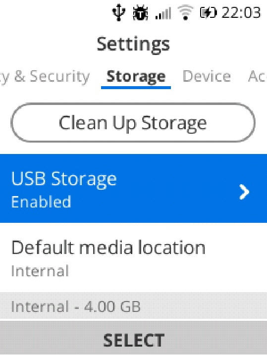

# ADB and WebIDE

*Not to be confused with [jailbreaking] on iOS devices, which is the act of using exploits to gain elevated permissions and bypass Apple's security restrictions on their devices.*

Now, let's learn how to sideload and debug an application on your KaiOS phone using ADB and WebIDE. This will let us install apps which might be not available from KaiStore, or ones that you are developing.

ADB, short for Android Debug Bridge, is a powerful toolset that can be used on Android-based devices to unlock access to a range of functions beyond what the typical user interface provides. It's mainly designed for app developers to get access to system logs and debug the performance of their apps, but it's also a great tools for power users and enthusiasts to control their phones through shell access, install third-party APKs, tweak the system and restore it from being a dead paperweight.

While KaiOS and Firefox OS are not directly based on Android and you cannot install APKs on them, their Gonk layer [makes significant use of Android's well-established hardware compatibility], including the ability to use ADB to interact with the phone through a computer. This is for the sake of deploying the OS onto different hardware without raising the cost for development.

Meanwhile, WebIDE, short for Web Integrated Development Environment, allows you to create, edit, run and debug web applications on Firefox OS (and later KaiOS) devices and simulators. It's [built on the former Firefox OS App Manager] but with additional functions such as a code editor, boilerplate code templates and manifest validation, and includes Firefox debugging tools. With it, you can also connect your browser to one or multiple "runtimes" where you can manage app installation.

We'll refer to this guide as the main, officially supported method of installing third-party apps onto your KaiOS phone, for the sake of simplicity. Other methods, such as Luxferre's CLI `gdeploy`, are also available.

{:.note}
> This guide is only applicable on debug-enabled KaiOS 2.5 devices, and is no longer relevant for recent versions. In 2021, [Mozilla partnered with KaiOS Technologies] to "modernize the old Boot2Gecko codebase to run atop a modern Gecko so that it can be used by KaiOS as a basis for their future phones", and redesigned WebIDE in the process (currently included in Firefox Developer Edition).
> 
> For debug-enabled KaiOS 3 devices, follow the instructions for KaiOS’s `appscmd` on [the official Developer Portal].
>
> Before proceeding, make sure that your phone is debug-enabled, or you have taken steps to enable debugging capability on your phone. To check if your phone is debug-enabled, go to [Devices page on BananaHackers Wiki].
>
> **Be careful when installing apps from unknown sources**; it's never a bad practice to proof-read their source code. While there are certain security practices, such as prohibiting installing apps with `engmode-extension` permission, KaiOS is still [prone to] [malicious code] which can result in performance degradation, data loss or worse.

## What we need

- a phone running KaiOS 2.5 (again, KaiOS 3 users should NOT follow this guide);
- a x86_64 computer running Windows, macOS or Linux;
	- armhf/aarch64 users may need to use `gdeploy` or [build one of the browsers below from source]
- an USB cable with data transferring capability;
- an Internet connection for both your phone and computer;
- an archiver: built-in file manager on macOS/Linux, [7-Zip] or WinRAR on Windows; 
- latest version of Android Debug Bridge (ADB): [Windows], [macOS], [Linux]
    - you can also install from your operating system's package manager:
    - Windows:
        - [Chocolatey][choco]: `choco install adb`
        - Scoop: `scoop install main/adb` 
        - `winget` [prohibits installing executables with symlinks]
    - [macOS (Homebrew)][brew]: `brew install android-platform-tools`
    - Debian/Ubuntu: `sudo apt-get install adb`
    - [Fedora][dnf]: `sudo dnf install android-tools`
    - [Arch]/Manjaro: `sudo pacman -S android-tools`
    - Termux (terminal emulator on Android): `pkg install android-tools`
    - *tip: If you download the SDK from Android Developers' website, [include the extracted ADB folder in PATH for quick access]. This will be handled for you if you've installed ADB via package manager.*
- Mozilla got rid of the old WebIDE since Firefox 59, so we'll have to install an older version of Firefox:
    - [Waterfox Classic][waterfox]: the most recently maintained browser which still has old WebIDE
    - [Pale Moon 28.6.1](https://archive.palemoon.org/palemoon/28.x/28.6.1/) (Windows/Linux): a popular fork of Firefox with older user interface, legacy Firefox add-on support and always runs in single-process mode.
    - Firefox 59 (ESR 52.9): the last official Firefox version to be bundled with working WebIDE and other tools for development on Firefox OS devices, before Mozilla decided to kill the project in 2016. Archives of all Firefox releases can be found [here](https://archive.mozilla.org).
    - [KaiOS RunTime] (Ubuntu): official development environment for KaiOS 2.5 made by KaiOS. It's also possible to get KaiOSRT to work on Windows 10 and later using Windows Subsystem for Linux (WSLg). [See this video on YouTube for action].

*Need a video tutorial? If you’re on Linux, KaiOS Technologies officially made one for their own WebIDE client KaiOSRT which can be found [on their channel]. Alternatively, there’s also [one on BananaHackers’ YouTube channel].*

---

Begin by turning on debugging mode on your phone and connecting your phone to the computer with the USB cable. This step will differ for each device; if you're unsure, it's best to look up your phone on the [Devices page on BananaHackers Wiki].

On your computer, install ADB from the package manager, or download the SDK Platform Tools from Android Developers' website, which should contain the latest version of ADB. Extract the downloaded archive to a folder, then navigate to the `platform-tools` folder using Command Prompt or Terminal.


Start the ADB daemon by typing `adb devices`. ADB will automatically detect your phone in debugging mode. Proceed when you see a `device`, otherwise:

- if the operating system states that `adb` is not a valid command, check if you're in the right folder and/or if `platform-tools` was properly added in PATH. You may need to specify `./adb.exe devices` to tell the OS where to look for ADB, or make ADB an executable: `chmod +x adb`.
- if ADB executes but nothing appears under "List of devices attached" (as shown below), check if your phone is properly connected to the computer. On Windows, you may need to open Driver Manager (<kbd>Win</kbd> + <kbd>R</kbd>, `devmgmt.msc`) and look for any USB peripherals with missing drivers, and install accordingly.
- if you’re connecting to a Linux-based computer, you may need to go to Settings, Storage and turn on USB Storage on the phone for `udev` to properly register your phone as an USB peripheral with external storage. An icon in the status bar will appear indicating storage access via USB. (If you don't wish to do this, see Setting up USB access on Linux below.)
- on macOS and Linux, `udev` and `lsusb` are your friends to troubleshoot any USB connection issues here
- if a device appears as `unauthorized`, it means that you need to approve the ADB connection to your phone with a pop-up on your phone's screen. Except... KaiOS does not have such thing! You're pretty much stuck here until someone figures out how to get your phone accessible by ADB.

```console
$ adb devices
* daemon not running; starting now at tcp:5037  
* daemon started successfully  
List of devices attached
1a2b3c4d        device
```

<details markdown="block"><summary>Connect to ADB over Wi-Fi</summary>

---

*I was not able to get this to work. Proceed with caution.*

If you are in a rush and wish to connect to your phone wirelessly, turn on Wi-Fi on your phone, set the TCP/IP socket on the phone to 5555:

```console
$ adb tcpip 5555
restarting in TCP mode port: 5555
```

Disconnect the USB cable, wait a moment, then run:

```console
$ adb connect 192.168.1.14:5555
connected to 192.168.1.14:5555

$ adb devices
List of devices attached
192.168.1.14:5555       device

$ adb forward tcp:6000 localfilesystem:/data/local/debugger-socket
6000
```

Replace `192.168.1.14` with your phone's IP address assigned by local network—the same network your computer is on.

You can find your phone's local IP address (192.168.1.x) by going to Settings, Network & Connectivity, Wi-Fi, Available networks, click on the connected Wi-Fi access point and look under IP address; or download N4NO’s [My IP Address] from KaiStore.

It's also possible to connect to your phone entirely without an USB cable, though the connection will be less reliable. See [Connect to ADB wirelessly on Launch hidden settings] page for more details.

---

</details>

Download and install either the latest version of Waterfox Classic, Firefox 59/ESR 52.9 or Pale Moon 28.6.1 corresponding to your operating system. We'll use Waterfox Classic for WebIDE here, as this is the most recently maintained browser to-date, but setting up WebIDE on other browsers should not be different.


Open the browser and press <kbd>Alt</kbd> to show the menu bar, then select Tools, Web Developer, WebIDE (or press <kbd>Shift</kbd> + <kbd>F8</kbd>).

{:.tip}
> Execute this command to open WebIDE without having to start Waterfox Classic beforehand:
> ```console
> waterfox.exe -chrome chrome://webide/content/webide.xul
> ```

<p align="center"></p>

Your phone’s name should appear in the right pane as an option under USB Devices. Click it to connect.

If you don't see any devices, either because you're setting up WebIDE for the first time, or your browser doesn't have a working `adbd` daemon, forward ADB access to TCP socket 6000:

```console
$ adb forward tcp:6000 localfilesystem:/data/local/debugger-socket
6000
```

Then, click Remote Runtime in the right pane, leave it as default at `localhost:6000` and press OK. If you still see a yellow banner stating "Operation failed: Connecting to Remote Runtime", either you set the incorrect socket or your phone rejected DevTools access.

<p align="center"></p>

*If you’re using older browsers to access WebIDE such as Firefox v59 or Pale Moon <28.6.1, at this point you may see a warning header about mismatched build date. You can safely ignore it as WebIDE was mainly designed to support Firefox OS device builds released alongside that Firefox/Pale Moon versions.*

To sideload an application, download a packaged file (you can find great apps on [BananaHackers Store] and GitHub!) and extract it into a dedicated folder. Make sure that there's a `manifest.webapp` at the root of the extracted folder. If you see an `application.zip` (which indicates the app was packaged for OmniSD), unzip it.

<p align="center"></p>

In WebIDE, select Open Packaged App in its left sidebar and navigate to the root of the app folder you just extracted (again, make sure that there's a `manifest.webapp` at its root!)

<p align="center"></p>

Once you get the app loaded with no errors, press the triangle Install and Run in the top bar to sideload.

*Feel free to ignore this warning: "app submission to the Marketplace requires a [size in px] icon". if you were to upload your apps to the Firefox Marketplace, a 128px icon is required to display your app in the splash screen. While KaiStore also requires app icons to be in certain sizes, a 128px icon is no longer necessary, [only 56px and 112px]. You can get rid of this error by including a 128px icon in the app's manifest.*

# Setting up USB access on Linux

Dedicated to those adrenaline-fueled who want to complicate their lives.

For security reasons, if you want to plug in your phone for debugging only and without USB Storage on, which would grant your computer access to the phone's internal storage, you will need to set `udev` rules to grant `plugdev` read-write access to the socket on your phone.

Initialise `udev` rules by installing `android-sdk-platform-tools-common` on Debian and Ubuntu, or `android-tools` (`android-tools-git` on AUR) on Arch-based distros. Otherwise, you can also install `wget` and `coreutils` if they're not already installed, then manually download and install `51-android.rules` by typing:

```console
$ wget -S -O - https://raw.githubusercontent.com/cm-b2g/B2G/1230463/tools/51-android.rules | sudo tee >/dev/null /etc/udev/rules.d/51-android.rules; sudo udevadm control --reload-rules
```

`wget` will fetch a list of `udev` rules from cm-b2g/B2G, then pass the result to `tee` which will write the content onto `/etc/udev/rules.d/51-android.rules` without displaying any output in Terminal, and `udevadm` will then reload the rules from configured locations.

Plug your phone to the computer using an USB cable and obtain the Vendor ID of the phone:

```console
$ lsusb
Bus 001 Device 007: ID 05c6:f003 Qualcomm, Inc. Nokia 8110 4G
                       ^^^^
```

In our case, the Qualcomm-based Nokia 8110 4G has the Vendor ID of `05c6`.

Open `/etc/udev/rules.d/51-android.rules` in your preferred text editor with root privileges. Append this line, replace `05c6` with the Vendor ID you got above:

```
SUBSYSTEM=="usb", ATTR{idVendor}=="05c6", MODE="0664", GROUP="plugdev"
```

This will allow read-write access to the USB device with vendor ID `05c6` for the system and users in the `plugdev` group, and read-only access for others (`rw-rw-r--`). Add yourself in the `plugdev` group:

```console
# usermod -aG plugdev $LOGNAME
```

Execute this command as root to make `51-android.rules` read-only for all users on the system:

```
# chmod a+r /etc/udev/rules.d/51-android.rules
```

Now, create `~/.android/adb_usb.ini` in your HOME directory. Open it using your preferred text editor and put the obtained Vendor ID value in HEX: `0xABCD`, whereas `ABCD` is Vendor ID.

```console
$ echo "0x05c6" > ~/.android/adb_usb.ini
```

Finally, re-run `adb devices`.

**References used for this page**

- [ADB & Fastboot](https://ivan-hc.github.io/bananahackers/adb.html) and [WebIDE and other Development tools](https://ivan-hc.github.io/bananahackers/webide.html) on BananaHackers website
- Martin Kaptein's [Side-loading and deploying custom apps to KaiOS](https://mk24.me/blog/sideloading-and-deploying-apps-to-kai-os/) blog post
- [Android Debug Bridge](https://wiki.archlinux.org/title/Android_Debug_Bridge) on Arch Linux Wiki, distributed under GNU Free Documentation License 1.3
- [Run apps on a hardware device](https://developer.android.com/studio/run/device) on Android Developers' website, distributed under Apache 2.0 License

[the hidden Developer menu]: https://w2d.bananahackers.net
[jailbreaking]: https://en.wikipedia.org/wiki/IOS_jailbreaking
[makes significant use of Android's well-established hardware compatibility]: https://kaios.dev/2024/03/kaios-system-properties/
[built on the former Firefox OS App Manager]: https://www.infoq.com/news/2014/06/webide/
[Mozilla partnered with KaiOS Technologies]: https://wiki.mozilla.org/KaiOS
[the official Developer Portal]: https://developer.kaiostech.com/docs/sfp-3.0/getting-started/env-setup/os-env-setup
[Devices page on BananaHackers Wiki]: https://wiki.bananahackers.net/devices
[prone to]: https://www.reddit.com/r/KaiOS/comments/1d0iur3/security_analysis_of_the_kaios_feature_phone/ "Note: Fabrice Desré, former Chief Architect of KaiOS Technologies, confirmed that there are factual errors in the report i.e. apps are handled in their own processes rather than in the same runtime, and that the research team never contacted KaiOS."
[malicious code]: https://research.nccgroup.com/2020/08/24/whitepaper-exploring-the-security-of-kaios-mobile-applications/
[build one of the browsers below from source]: https://new.reddit.com/r/KaiOS/comments/rawwhz/webide_capable_program_linux_arm/
[7-Zip]: https://www.7-zip.org/download.html
[Windows]: https://dl.google.com/android/repository/platform-tools-latest-windows.zip
[macOS]: https://dl.google.com/android/repository/platform-tools-latest-darwin.zip
[Linux]: https://dl.google.com/android/repository/platform-tools-latest-linux.zip
[choco]: https://community.chocolatey.org/packages/adb
[prohibits installing executables with symlinks]: https://github.com/microsoft/winget-pkgs/issues/4082
[brew]: https://formulae.brew.sh/cask/android-platform-tools
[dnf]: https://packages.fedoraproject.org/pkgs/android-tools/android-tools
[Arch]: https://archlinux.org/packages/extra/x86_64/android-tools
[include the extracted ADB folder in PATH for quick access]: https://gist.github.com/nex3/c395b2f8fd4b02068be37c961301caa7
[waterfox]: https://classic.waterfox.net
[Pale Moon 28.6.1]: https://archive.palemoon.org/palemoon/28.x/28.6.1/
[KaiOS RunTime]: https://s3.amazonaws.com/kaicloudsimulatordl/developer-portal/simulator/Kaiosrt_ubuntu.tar.bz2
[See this video on YouTube for action]: https://youtu.be/eg2SOCTMxYU
[on their channel]: https://www.youtube.com/watch?v=wI-HW2cLrew
[one on BananaHackers’ YouTube channel]: https://www.youtube.com/watch?v=SoKD7IBTvM4
[My IP Address]: https://www.kaiostech.com/store/apps/?bundle_id=com.n4no.myipaddress
[Connect to ADB wirelessly on Launch hidden settings]: https://bmndc.github.io/nokia-leo/w2d#connect-to-adb-wirelessly
[BananaHackers Store]: https://store.bananahackers.net
[only 56px and 112px]: https://developer.kaiostech.com/docs/distribution/submission-guideline/
[Make KaiOS Install]: https://github.com/jkelol111/make-kaios-install

<!-- {:.warning}
> KaiOS 2.5 only. To sideload apps on debug-enabled KaiOS 3 devices, follow the instructions on using KaiOS's in-house `appscmd` on [the official Developer Portal](https://developer.kaiostech.com/docs/sfp-3.0/getting-started/env-setup/os-env-setup).

According to [How-To Geek](https://www.howtogeek.com/773639/what-is-sideloading-and-should-you-do-it), sideloading is 'the practice of installing software on a device without using the approved app store or software distribution channel'. This can be useful if you want to use an app that is either not eligible for distributing over KaiStore, not available in your region, or if you want to test an app that you are developing.

This is where Android Debug Bridge (ADB) and WebIDE come in. Inherited from the now-defunct Firefox OS, WebIDE allows you to manage installed applications and configurations on KaiOS phones. It works by communicating with a specific port on your phone over ADB, an internal protocol for engineers usually found on Android devices.

Before you ask: no, despite using Android compatibility layer for hardware support, KaiOS isn't Android and cannot run APKs. It uses Gecko the browser engine for rendering apps, and they typically come in the form of ZIP archive files, which consists of HTML, styling and JavaScript code for functionality.

## Sideloading 101
### What we'll need
- a computer with command-line tool installed: Command Prompt on Windows, Terminal on macOS/Linux
- [a debug-enabled phone running KaiOS 2.5]()
- an USB cable with data transferring
- an Internet connection to download tools and navigate to W2D (optional if there are debug codes)
- an archive extractor installed to extract our tools:
  - on macOS/Linux, use Finder, built-in file manager or `unzip`;
  - on Windows, use [7-Zip](https://www.7-zip.org) or WinRAR if you prefer
- [Android Developers' SDK Platform Tools](https://developer.android.com/tools/releases/platform-tools) or install ADB via your package manager (we'll guide you below)
- [Waterfox Classic](https://classic.waterfox.net): most up-to-date pre-Photon fork of Firefox with WebIDE
- most importantly, computer skills and patience

*Need a video tutorial? If you're on Linux, KaiOS Technologies officially made one for their own WebIDE client KaiOSRT which can be found [here](https://www.youtube.com/watch?v=wI-HW2cLrew). Alternatively, there's also one on BananaHackers' YouTube channel [here](https://www.youtube.com/watch?v=SoKD7IBTvM4).*

<div class="w2d">
  
  <p class="fs-2"><em>W2D website</em></p>
</div>

### Turn on debugging mode on your phone
1. Check whether your phone can be debugged and any special notes to follow on the [Devices page]().
   - Some may have specific codes that can be dialed to quickly activate debugging mode, i.e. `*#*#33284#*#*` for Nokia devices and both `*#*#33284#*#*` and `*#*#0574#*#*` for Energizers and others. Details can be found on each device page.
2. Navigate to https://w2d.bananahackers.net using default Browser on the phone. Use D-Pad keys to move the cursor and click on the big front <kbd>Launch Developer menu</kbd> button.
3. In the newly opened Developer menu, select the first <kbd>Debugger</kbd> option, then <kbd>ADB and DevTools</kbd> from the dropdown menu. You should see a bug icon in the status bar letting you know ~~your phone has bugs inside~~ you're in debugging mode.
4. If you're connecting to a Linux-based PC, you may need to go to Settings, Storage and turn on <kbd>USB Storage</kbd> for `udev` to properly register your phone as an USB peripheral. An icon in the status bar will appear indicating storage access via USB.
   - If you need to skip this step, feel free to go through the painstaking [Setting up USB access on Linux](#setting-up-usb-access-on-linux) process below.

<p align="center">
  
  
</p>

5. Connect the phone to your computer with the USB cable.
{:style="counter-reset:none"}

### Download and set up ADB
> Now, if your operating system has a package manager, you can utilize that to quickly install and set up ADB:
> * Windows: `choco install adb` 
> (`winget` unfortunately [prohibits installing executables with symlinks](https://github.com/microsoft/winget-pkgs/issues/4082))
> * macOS: `brew install android-platform-tools`
> * Linux (Debian/Ubuntu): `sudo apt-get install adb fastboot`
> * Linux (Fedora): `sudo dnf install android-tools`
> * Linux (Arch): `sudo pacman -S android-tools`
> 
> Skip to next part when you're done.

6. On your computer, visit [Android Developers' SDK Platform Tools](https://developer.android.com/tools/releases/platform-tools) website and click on the link correspond to your operating system under the Downloads section. Read the terms if you want to, tick the box and click the green button to have the SDK downloaded to your computer.
{:style="counter-reset:none"}


7. Extract the downloaded archive to a folder (double-click the file on macOS/Linux, 7-Zip > <kbd>Extract here</kbd> on Windows), navigate to its `platform-tools` root and open a command-line window by that directory.
{:style="counter-reset:none"}

8. Type `adb devices` to start the ADB binary server. ADB will automatically detect all devices with active debugging mode connected to the computer over USB. If a `device` shows, you're good to go! Otherwise, go back, check if you've missed any steps or whether [your phone supports ADB]().
{:style="counter-reset:none"}
   - Note that if you're unable to run `adb`, you may need to make it an executable: `chmod +x ./adb`

```
$ adb devices
* daemon not running; starting now at tcp:5037
* daemon started successfully
List of devices attached
1a2b3c4d	device
```

9. If you use other WebIDE clients, or if you have trouble connecting later on as `adbd` fails to detect your phone, forward ADB access to TCP socket 6000 for debugging:
{:style="counter-reset:none"}

```
$ adb forward tcp:6000 localfilesystem:/data/local/debugger-socket
6000
```
*Tip: If you've downloaded the SDK package from Android Developers' website, for quicker access next time, include the extracted ADB folder in PATH. We won't cover this here as this would be a lengthy process. This will be automatically handled if you've installed ADB via package manager.*

<details>
  <summary>Connect to ADB over Wi-Fi</summary>
WIP
</details>

### Connect to WebIDE

10. We'll use [Waterfox Classic](https://classic.waterfox.net) for WebIDE (Firefox 59 and Pale Moon <28.6.1 will also do the job just fine). To download, head to the browser's homepage, download and install the version correspond to your OS.
{:style="counter-reset:none"}


11. Open Waterfox Classic and press the hamburger menu button at the right end of the toolbar, click the <kbd>Developer</kbd> entry (tenth option from top to bottom, left to right), then click <kbd>WebIDE</kbd>.
{:style="counter-reset:none"}

<div class="altf8">
  
  <p class="fs-2"><em>Tip: For quicker access to WebIDE, press its shortcut <kbd>Shift</kbd> + <kbd>F8</kbd> while you're in the browser.</em></p>
</div>

12. Your phone's name should appear in the right pane as the first option under USB Devices section. Click it to connect. If you don't see any, click <kbd>Remote Runtime</kbd> in the right pane, leave it as default at `localhost:6000` and press OK. If you still cannot connect your phone to WebIDE, check if you've missed any steps or whether [your phone allows DevTools]().
{:style="counter-reset:none"}


*If you're using other means to access WebIDE such as Firefox v59 or Pale Moon <28.6.1, you may now see a warning header about mismatched build date. You can safely ignore it as WebIDE was mainly designed to support Firefox OS device builds released alongside that Firefox/Pale Moon versions.*

### Ready to sideload apps

{:style="counter-reset:none"}
13. To sideload an app, download it (you can find lots of great apps on [BananaHackers Store](https://store.bananahackers.net) and GitHub!) and extract its ZIP content (if you see an OmniSD-packaged `application.zip` you may need to extract that too).

14. Select <kbd>Open Packaged Apps</kbd> in WebIDE's left sidebar (second option from top) and navigate to the root of the app folder you just extracted.

15. Once you've got the app loaded, press the triangle <kbd>Install and Run</kbd> in the top bar to sideload!


> If you encounter an issue in a sideloaded app and want to debug, click the wrench to open the Developer Tools.

## Other WebIDE alternatives
* [KaiOS RunTime](https://developer.kaiostech.com/docs/02.getting-started/01.env-setup/simulator) (Linux): official developing environment for KaiOS 2.5 made by KaiOS Technologies the company. 
  - To download and set up KaiOSRT on Ubuntu, type these commands one-by-one in Terminal:

```
wget https://s3.amazonaws.com/kaicloudsimulatordl/developer-portal/simulator/Kaiosrt_ubuntu.tar.bz2
tar -axvf Kaiosrt_ubuntu.tar.bz2
cd kaiosrt-v2.5-ubuntu-20190925163557-n378
tar -axvf kaiosrt-v2.5.en-US.linux-x86_64.tar.bz2
cd kaiosrt
./kaiosrt
```
*It's also possible to get KaiOSRT to work on Windows 10 and later using Windows Subsystem for Linux (WSLg). [See this video on YouTube for action](https://youtu.be/eg2SOCTMxYU).*

* Firefox 59 (ESR 52.9): the last official Firefox version to bundle with working WebIDE and other tools for development on Firefox OS devices, before Mozilla decided to kill the project in 2016. Archives of all Firefox releases can be found [here](https://archive.mozilla.org).
* Pale Moon 28.6.1 (Windows/Linux): a popular fork of Firefox with older user interface, legacy Firefox add-on support and always running in single-process mode. Archives of all releases can be found [here]( https://www.palemoon.org/archived.shtml).
* jkelol111's [Make KaiOS Install](https://github.com/jkelol111/make-kaios-install): another command-line tool to install apps using KaiOS's remote debugging protocol.

## Setting up USB access on Linux
Dedicated to those adrenaline-fueled who want to complicate their lives.

1. Download and install `51-android.rules` by typing this long streak of command:

```
$ wget -S -O - https://raw.githubusercontent.com/cm-b2g/B2G/1230463/tools/51-android.rules | sudo tee >/dev/null /etc/udev/rules.d/51-android.rules; sudo udevadm control --reload-rules
```
2. Plug your phone to the computer using an USB cable and obtain the Vendor ID of the phone:
{:style="counter-reset:none"}

```
$ lsusb
Bus 001 Device 007: ID 05c6:f003 Qualcomm, Inc. Nokia 8110 4G
                       ^^^^
```
In our case, the Qualcomm-based 8110 4G has the Vendor ID of `05c6`.

3. Open `/etc/udev/rules.d/51-android.rules` in your preferred text editor ***as root***. Append this line, replace `05c6` with the Vendor ID you got above:
{:style="counter-reset:none"}

```
SUBSYSTEM=="usb", ATTR{idVendor}=="05c6", MODE="0664", GROUP="plugdev"
```

4. Execute this command ***as root*** to make `51-android.rules` read-only for all users on the system:
{:style="counter-reset:none"}

```
$ sudo chmod a+r /etc/udev/rules.d/51-android.rules
```

5. Now, no longer as root, create `~/.android/adb_usb.ini` in your HOME directory. Open it using your preferred text editor and put the obtained Vendor ID value in HEX: `0xABCD`, whereas `ABCD` is Vendor ID
{:style="counter-reset:none"}

6. Re-run `adb devices`.

<style>
  .w2d {
    @media (min-width:1100px) { width: 265px; float: right; padding: 0 0 30px 25px }
    margin: 0 auto; max-width: 240px;
  }
  .w2d p { margin: 0; padding: 0 }
  .altf8 { max-width: 485px; margin: 0 auto }
  .altf8 p { margin: 0; padding: 0 }
</style> -->