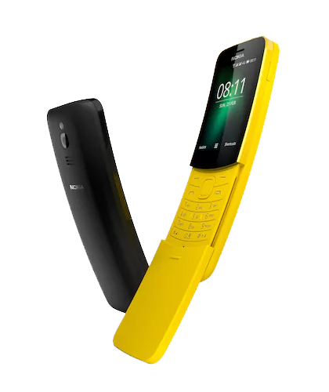

# Nokia 8110 4G (nokia-argon)
{: .no_toc }

  
View device specification table

<table>
  <thead><tr><th colspan="2">Nokia 8110 4G (nokia-argon)</th></tr></thead>
  <tbody>
    <tr><td>Announced</td><td>25 February 2018 (MWC 2018)</td></tr>
    <tr><td>Released</td><td>23 April 2018</td></tr>
    <tr><td>Model</td><td>TA-1048, TA-1059, TA-1067, TA-1071</td></tr>
  <tr><td colspan="2"><strong>Specifications</strong></td></tr>
    <tr><td>SoC</td><td>Qualcomm MSM8905 Snapdragon 205 (2 x 1.1GHz Cortex-A7)</td></tr>
    <tr><td>RAM</td><td>512MB LPDDR3</td></tr>
    <tr><td>GPU</td><td>Adreno 304</td></tr>
    <tr><td>Storage</td><td>4GB eMMC 4.5 (+ up to 32GB microSDHC card)</td></tr>
    <tr><td>Network</td><td>2G GSM, 3G UMTS, 4G LTE Cat4 150/50Mbps <em>+ EU: band 1, 3, 5, 7, 8, 20 + APAC, MENA, SSA: band 1, 3, 5, 7, 8, 20, 38/41 (120MHz), 39, 40</em> VoLTE/VoWiFi support Single or Dual SIM (Micro-SIM + Nano-SIM, dual-standby)</td></tr>
    <tr><td>Screen</td><td>320 x 240 @ 167 PPI 2.45 inches QVGA TFT LCD, 256K colors</td></tr>
    <tr><td>Bluetooth</td><td>4.1, A2DP, LE</td></tr>
    <tr><td>Wi-Fi</td><td>802.11b/g/n, 2.4GHz, Hotspot</td></tr>
    <tr><td>Peripherals</td><td>GPS, GLONASS</td></tr>
    <tr><td>Cameras</td><td>Rear: 2MP, LED flash</td></tr>
    <tr><td>Dimensions (HWD)</td><td>133.5 * 49.3 * 14.9 (mm) 5.26 * 1.94 * 0.59 (in)</td></tr>
    <tr><td>Weight</td><td>117 g (4.13 oz)</td></tr>
    <tr><td>Ports</td><td>- microUSB charging &amp; USB 2.0 data transferring port - 3.5mm headphone jack</td></tr>
    <tr><td>Specials</td><td>IP52 drip protection</td></tr>
    <tr><td>Battery</td><td>Removable Li-Ion 1500mAh (up to 25 days of 4G standby advertised)</td></tr>
  <tr><td colspan="2"><strong>KaiOS info</strong></td></tr>
    <tr><td>Version</td><td>KaiOS 2.5, upgradable to KaiOS 2.5.1</td></tr>
    <tr><td>WA VoIP</td><td>Not supported</td></tr>
    <tr><td>Build no.</td><td>10.00.17.02, 11.00.17.03, 12.00.17.06/10, 13.00.17.01, 14.00.17.04, 15.00.17.03, 16.00.17.00, 17.00.17.01</td></tr>
  </tbody>
</table>

Table of Contents
{: .text-delta }
- TOC
{:toc}

*Illustration by eBoy. Creative Director: [Tim van der Mee](https://timvandermee.com/Nokia-8110-Reloaded)*
{:.fs-2}

## Don't buy a counterfeit
**BEWARE OF COUNTERFEIT DEVICES!** Many KaiOS devices, such as the Nokia 8110 4G, 2720 Flip and 6300 4G are being offered at numerous tech stores and online sites for amazingly low prices; those turn out to be counterfeits and don't bring the experiences that people expected, and you wouldn't be able to get a refund as the store gets away with it.

To spot out the counterfeits:
- Brand-new KaiOS devices, even after their lifespan on the shelf, DON'T cost less than 60% of their original prices.
- HMD/Nokia Mobile DON'T sell any of their KaiOS devices in 2G only. KaiOS devices are required to have at least 3G, as 2G is being phased out in many places.
- Different packaging: 8110 4G and 2720 Flip comes in partially transparent plastic boxes with flaps on top and bottom, while 6300 4G comes in hard cardboard box. Advertising prints on the box may have missing features, bad quality printing, weird grammar or letter spacing.
- Terrible build quality when comparing side-by-side. [To quote u/cannotelaborate on Reddit](https://www.reddit.com/r/KaiOS/comments/xglkr7/well_darn_it_i_just_received_a_counterfeit_nokia):
  - Build quality is horrific, the battery and SIM cards barely fit in [their trays].
  - It takes only like 10 seconds to boot, shows KaiOS logo briefly, then plays the old Nokia chime.
  - Speaker quality is awful.
  - The buttons' faces are low quality and aren't flush with the overall surface, some of them are crooked.
- Remove the battery and look for the printed information on the sticker, i.e. if the CODE is 23BTS70**VN**00, it is intended to sold in Vietnam only. You can also look for it in the OS by dialing *#0000#.
- If the user interface looks off with weird alignments and margins between elements, that's also a clue.
- Under all circumstances, all KaiOS devices should have services like KaiStore installed by default.
- Browser is NOT Opera Mini 4.4. KaiOS does NOT run Java apps or MRE apps.
- If you have access to a computer, try connecting the phone to it and see if the actual phone storage is significantly less than advertised.

Remember, **only buy from trusted, reputable sources**, even if they offer higher prices. That higher cost usually guarantees that you're buying a genuine device.

## Known issues
- **[MAJOR]** Keypad design with small key surface and the last row of keys being hidden under the slider, together with fast keypress timeout leading to the phone registering multiple or no keystrokes instead of single, making typing on the phone unpleasant. [BananaHackers' guide on fixing the keypad speed](https://ivan-hc.github.io/bananahackers/fix-the-keypad-speed.html) may help
- High LTE latency, especially on Wi-Fi hotspot (don't expect too much from Cat4 speed).

### KaiOS-specific
- This phone runs KaiOS 2.5, which itself is based on Gecko 48 from 2016, meaning without optimizations and new web technologies, some websites like Instagram and Uber just fall apart and the overall performance is unbearable.
  - No built-in Widevine DRM decoders, which means the phone is NOT capable of playing DRM-protected content from e.g. Spotify
- **[MAJOR]** Some built-in apps, such as Call logs, Contacts or Music, are written in a way that is performance-intensive and not optimized for the phone, causing slow rendering and system lags if you store a large number of contacts (technically infinite but 100 recommended), call logs (max 40), music files or other items in a list. 
  - *Performance issues has been addressed on later versions, for now you should opt for alternatives such as [arma7x's K-Music](https://github.com/arma7x/kaimusic) in KaiStore if possible.*
- **[MAJOR]** Sending text messages don't automatically convert to MMS in group chats. You'll have to add a message subject or file attachment before sending to manually do so, otherwise your message will be sent separately to each individual in the thread. Receiving works flawlessly.
  - *Group messaging over MMS has been properly implemented as a feature on later versions.*
- **[MAJOR]** Alarms can be delayed, unable to go off or go off unexpectedly if the Clock app is killed. Before going to sleep, make sure to open the Clock app and lock the phone without pressing the End call key or closing the app.
- You cannot change message notification tone or alarm tone on the phone outside the defaults provided. This is because both are not managed by the system, but by the Messages and Clock app themselves.
  - To change them, you'll have to use ADB to pull `sms.gaiamobile.org` and `clock.gaiamobile.org` from `/system/b2g/webapps`, extract, edit the audio files and repackage the apps, then push them back under `/data/local/webapps` and edit the `basePath` in `/data/local/webapps/webapps.json` to reflect the change (see [BananaHackers' guide](https://ivan-hc.github.io/bananahackers/clock-alarms.html#h.unmy3yif91xs) for instructions)
- D-Pad shortcuts and app shortcuts in the carousel menu (when you press Left on the home screen) are not customizable. *The former has been addressed on later versions*, but to change them on this phone you'll have to edit `launcher.gaiamobile.org`.
- Built-in email, calendar and contact syncing function with Google account may completely fail at times. Use IMAP and import contacts instead.
  - T9 search in Contacts app is missing. For those missing the feature, there's a port called [FastContact](https://gitlab.com/suborg/fastcontact) by Luxferre that you can sideload to use as an alternative.
  - E-Mail app lacks many crucial enterprise features, such as OAuth2 secure sign-in.
  - Speaking of built-in Calendar app, if you manage to opt for syncing your Google account with the phone, only the calendar *with your email address as its name* will sync.
 
### WhatsApp-specific
- 8MB download/5MB upload limit: This is to avoid 'out of memory' errors with the nature of WhatsApp's end-to-end encryption. All things sent through the app's servers—including photos and videos—are encrypted on device, and to decrypt them bit-by-bit would take huge chunks of memory, which isn't suitable for KaiOS devices having hardware as limited as 256MB of RAM.
- Pairing account with the WhatsApp Web interface or desktop applications is NOT possible, due to KaiOS devices' limitations on background processes and battery life, which prevents the feature from syncing decryption keys and mirroring messages & calls from the phone.
  - On a related note, you cannot sign into another device, pair with those interfaces and then sign into the KaiOS version of WhatsApp. Attempting to do so will result in the renewal of the decryption keys and all other devices being forced to log off automatically.

## Secret codes
- `*#*#33284*#*#`: Toggle debugging mode, allowing the phone to be accessed with ADB and DevTools. A bug icon will appear in the status bar letting you know debugging mode is on. This can also be turned on under *Settings, Device, Developer, Debugger, ADB and DevTools*.
- `*#06#`: Display the hidden International Mobile Equipment Identity numbers or IMEI(s). Do not show them to anyone else: they're crucial for calling functions on the phone.
- `*#0000#`: Display device information, such as firmware version, build date, model number, variant and CUID.
- `*#0606#`: Display the MEID(s), all zeroes.
- `###2324#`: Toggle Qualcomm diagnostic mode for fixing null/invalid IMEI or baseband via QPST.
- `#8378269#`/`##2637643##`: Open Testbox engineering menu with predecessor FirefoxOS design, usually used by OEMs to test various hardware of the phone.
- `##372733##`/`#2886#`: Open KaiOS's MMI Test utility.
- `#7223#`: Display internal firmware build and boot image versions.
- `##0574##`: Open LogManager utility.
- `#573564#`: Open T2M Log, a cut LogManager interface.
- `#091#` (on)/`*#092#` (off): Toggle auto-answering on incoming call.

#### Codes that don't work
{: .no_toc }
- `#1219#`: Should remove all user customizations (for display in store?)
- `#07#`: Should display SAR-related information.
- `##212018##`: Should toggle privileged access (including rooted shell) to the phone.
- `#8378266#`: Should also open Testbox engineering menu.
- `#1314#`: Switch the `auto.send.crash.sms` property, whose purpose is still unknown.

## Special boot modes
- **Recovery mode**: With the device powered off, hold the top Power button and the D-Pad Up key, or type `adb reboot recovery` when connected to a computer. Allows you to factory reset the device by wiping /data and /cache, view boot and kernel logs, and install patches from `adb sideload` interface or SD card.
- **Fastboot mode**: Only accessible and automatically kick in when /recovery is corrupted. Allows you to restore partitions under `fastboot` interface.
- **EDL mode**: With the device powered off, hold the top Power button and both the D-Pad Up and Down keys, or type `adb reboot edl` when connected to a computer. Boots into a black screen, allows you to read and write partitions in low-level with proprietary Qualcomm tools. Remove the battery to exit.

EDL programmer for this phone can be found on BananaHackers' [EDL archive site](http://edl.bananahackers.net/loaders/0x000940e100420050.mbn) with hardware ID 0x000940e100420050.

## Differences with the Indian variant

*I'm pretty sure someone wrote this had some strokes on English, but I can't bother to rephrase it right now. Maybe at a later date?*

> The global version of Nokia 8110 4G was released between June and July 2018, while the Indian version was released in September of the same year. The most obvious reason is certainly the exclusivity that Jio has on the platform in India: the pre-installed applications, including the JioStore, are the same as Jio Phone. You can also see it from the menu interface, whose icons show the name of the application, while in the global version this is shown at the top, when we select the application.
> 
> The guides on this site are compatible with all versions of Nokia 8110 4G, therefore also the Indian version. The delays in the release of this device in India make thinking of certain compromises that Jio had to find with HMD. In fact, not even the firmware version is the same as the global one:
> 
> - The global version starts from firmware v11 (June 2018) KaiOS 2.5, after a year (May 2019) with the firmware update v16 KaiOS 2.5.1 is also available, while the latest update of December 2019 brings with it the firmware v17;
> - The Indian version has remained stuck to v10 of the firmware, certainly faster and more versatile than any Jio Phone, but more limited than the global one in terms of performance and software updates, as the operating system has remained with the KaiOS 2.5 version (as any other Jio Phone).
> 
> However, the fundamental features that made the Nokia 8110 4G the true protagonist of these pages have remained preserved, and not blurred (unlike the now obsolete Jio Phone), and first of all the possibility of debugging on the device.
> 
> Since the partitions are interchangeable from one device to another, it is possible to convert the Indian variant into a global one with the official KaiStore fully functional and KaiOS updated to the latest version available. Find out how to do it by reading the dedicated guide:
> 
> - [Install v17(KaiOS 2.5.1 on Indian Nokia 8110 4G)](https://wiki.bananahackers.net/customizations/de-jioize-8110)
> 
> The whole website revolves around the 8110 4G and then around all the other Nokia phones, which are the best KaiOS devices ... so choose your tests without any problem! To learn more, visit the dedicated pages.

## UART debugging testpoint
On the mainboard of the 8110 4G, there's a UART TX testpoint running at 1.8V which can be used to read bootloader debug logs, marked by a red circle in the image below. You can use the shield on the left or the microUSB connector as ground.

Note that to read the entire log output, you'll need to have a custom OS kernel as the default isn't configured to do so.

(there might also be a UART RX testpoint on the board, but it's up to you to find it 😉)

## Source code
HMD Global/Nokia Mobile has published the device's source code for its Linux 3.10 kernel, B2G and certain third-party libraries used in this phone, which can be downloaded directly from [here](https://nokiaphones-opensource.azureedge.net/download/phones/Nokia_8110_4G_17.00.17.01_OSS.tar.gz) (backup: [Farooq](https://farooqkz.de1.hashbang.sh/storage/download?name=Nokia_8110_4G_17.00.17.01_OSS.tar.gz), [GitHub](https://github.com/farooqkz/gecko8110), [Codeberg](https://codeberg.org/farooqkz/gecko8110))

Note that the source code released does not contain proprietary parts from other parties like Qualcomm.