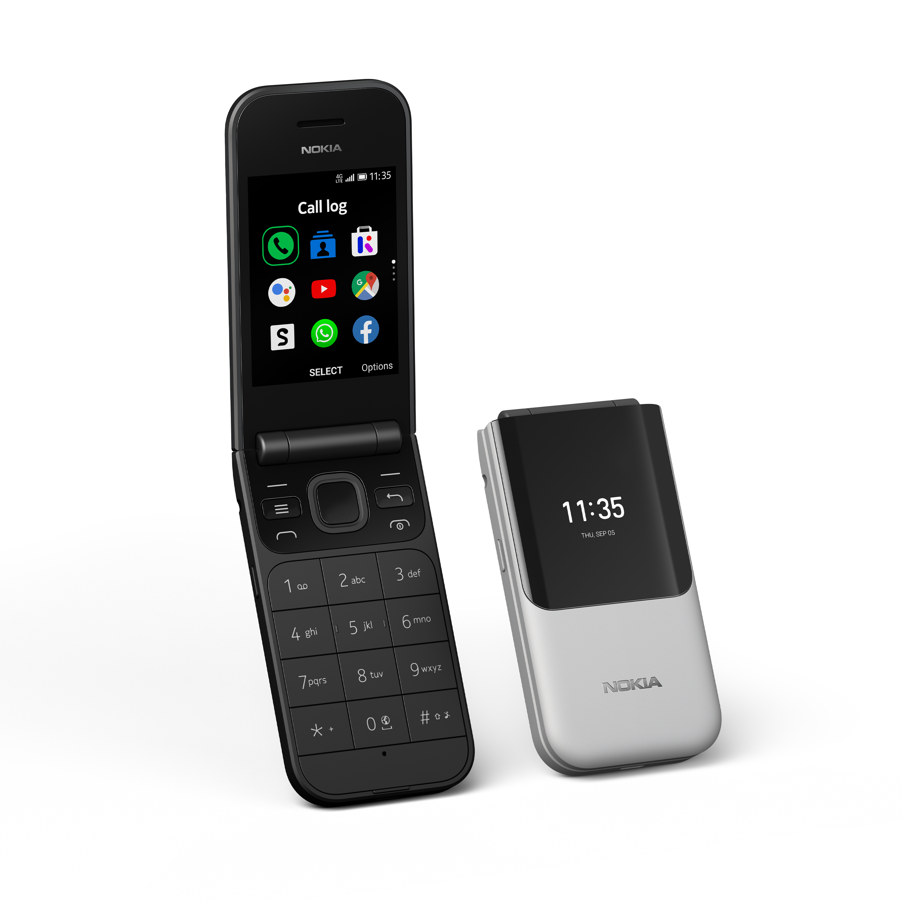
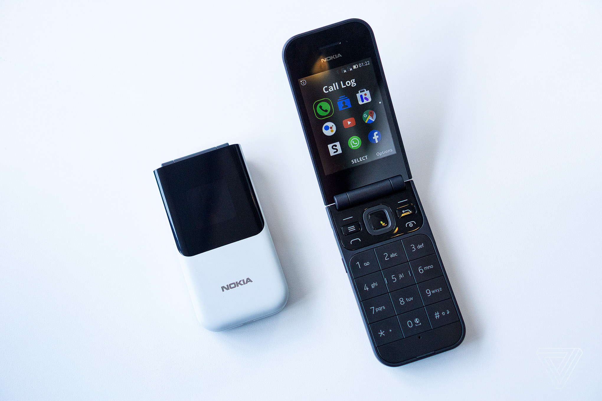

# Nokia 2720 Flip (nokia-beatles)
{: .no_toc }

  
View device specification table

<table>
  <thead><tr><th colspan="2">Nokia 2720 Flip (nokia-beatles)</th></tr></thead>
  <tbody>
    <tr><td>Released</td><td>5 September 2019</td></tr>
    <tr><td>Model</td><td>TA-1168, TA-1170, TA-1173, TA-1175</td></tr>
  <tr><td colspan="2">Specifications</td></tr>
    <tr><td>SoC</td><td>Qualcomm MSM8905 Snapdragon 205 (2 x 1.1GHz Cortex-A7)</td></tr>
    <tr><td>RAM</td><td>512MB LPDDR2/3</td></tr>
    <tr><td>GPU</td><td>Adreno 304</td></tr>
    <tr><td>Storage</td><td>4GB eMMC 4.5 (+ up to 32GB microSDHC card)</td></tr>
    <tr><td>Network</td><td>2G GSM, 3G UMTS, 4G LTE Cat4 150/50Mbps <em>+ EU: band 1, 3, 5, 7, 8, 20 + MENA, APAC, GCR: band 1, 3, 5, 7, 8, 20, 28, 38/41 (120MHz), 39, 40</em> VoLTE/VoWiFi support Single or Dual-SIM (Nano-SIM, dual-standby)</td></tr>
    <tr><td>Screen</td><td>Main: 320 x 240 @ 143 PPI, 2.8 inches QVGA TFT LCD 256K colors External: 240 x 240 @ 261 PPI, 1.3 inches TFT LCD</td></tr>
    <tr><td>Bluetooth</td><td>4.1, A2DP, LE</td></tr>
    <tr><td>Wi-Fi</td><td>802.11b/g/n, 2.4GHz, Hotspot</td></tr>
    <tr><td>Peripherals</td><td>GPS, GLONASS</td></tr>
    <tr><td>Cameras</td><td>Rear: 2MP, LED flash</td></tr>
    <tr><td>Dimensions (HWD)</td><td>Open: 192.7 * 54.5 * 11.6 (mm) 7.59 * 2.15 * 0.46 (in) Closed: 104.8 * 54.5 * 18.7 (mm)</td></tr>
    <tr><td>Weight</td><td>118 g (4.16 oz)</td></tr>
    <tr><td>Ports</td><td>- microUSB charging &amp; USB 2.0 data transferring port - 3.5mm headphone jack</td></tr>
    <tr><td>Battery</td><td>Removable Li-Ion 1500mAh (BL-6A/BV-6A), 5W wired charging (up to 43 days of GSM standby advertised)</td></tr>
  <tr><td colspan="2"><strong>KaiOS info</strong></td></tr>
    <tr><td>Version</td><td>KaiOS 2.5.2, upgradable to KaiOS 2.5.2.2</td></tr>
    <tr><td>WA VoIP</td><td>Supported (30.00.17.05 onwards)</td></tr>
    <tr><td>Build no.</td><td>12.00.17.01, 21.00.17.01, 22.00.17.01, 30.00.17.05, 40.00.17.01</td></tr>
  </tbody>
</table>

Table of Contents
{: .text-delta }
- TOC
{:toc}

Announced at IFA 2019 together with the rugged [Nokia 800 Tough](https://wiki.bananahackers.net/devices/nokia-800-tough), the budget Nokia 110, Nokia 6.2 and Nokia 7.2, the Nokia 2720 Flip is the second KaiOS phone to be released under the HMD-era as a successor to the bananaphone [Nokia 8110 4G](https://wiki.bananahackers.net/devices/nokia-8110-4g). This phone brings back the flip design inspired by the original Nokia 2720 Fold (2007) that many people loved, mixing it with 4G LTE connectivity and access to modern services such as WhatsApp, Facebook, Twitter, Google Maps and YouTube.

The phone also features:
- a big 2.8-inch screen on the inside and an external 1.3-inch screen for displaying time, incoming calls and text notifications
- large T9 keys for easier typing & support for adding custom words to T9 dictionary
- SOS emergency button that when double-pressing or holding will send current location and call preset contacts for assistance
- battery life that lasts up to a week on 4G standby
- with the latest OTA update: WhatsApp audio call support to stay connected with friends and family members

However, as with other KaiOS devices, it also features general bugs and performance hiccups, notably group text on sent wouldn't automatically convert to MMS making the text being sent to each individual in the chat, and system hanging at times. 

Overall plastic build material and hinge design are also hardware issues to consider when using the 2720 Flip in long-term. It's recommended to get a case and screen protection for this phone wherever possible.

- [Nokia 2720 Flip review: proof you can't opt out of the smartphone generation](https://www.theverge.com/2019/10/4/20896976/nokia-2720-flip-phone-review-specs-features-price) by The Verge
- [Review: Nokia 2720 Flip](https://nokiamob.net/2019/10/16/review-nokia-2720-flip/) by NokiaMob, with demo on the SOS emergency feature
- [Nokia 2720 Flip review](https://www.phonearena.com/reviews/Nokia-2720-Flip-Review_id4756) by PhoneArena
- [Nokia 2720 Flip, first thoughts](https://www.reddit.com/r/dumbphones/comments/uzo9xu/nokia_2720_flip_first_thoughts/) on r/dumbphones
- [Nokia 2720 Flip (2019) reviews and some hacks](https://www.reddit.com/r/KaiOS/comments/lp0y2e/nokia_2720_flip_2019_review_and_some_hacks/) on r/KaiOS
- [Thinking out on buying a Nokia 2720 flip for using it as a daily driver](https://www.reddit.com/r/KaiOS/comments/k3w5d2/thinking_out_on_buying_a_nokia_2720_flip_for/) on r/KaiOS

*[Photo by Chaim Gartenberg for The Verge](https://www.theverge.com/circuitbreaker/2019/9/5/20850793/nokia-2720-flip-phone-hmd-800-rugged-110-feature-phones-ifa-2019)*
{:.fs-2}

## Don't buy a counterfeit
**BEWARE OF COUNTERFEIT DEVICES!** Many KaiOS devices, such as the Nokia 8110 4G, 2720 Flip and 6300 4G are being offered at numerous tech stores and online sites for amazingly low prices; those turn out to be counterfeits and don't bring the experiences that people expected, and you wouldn't be able to get a refund as the store gets away with it.

To spot out the counterfeits:
- Brand-new KaiOS devices, even after their lifespan on the shelf, DON'T cost less than 60% of their original prices.
- HMD/Nokia Mobile DON'T sell any of their KaiOS devices in 2G only. KaiOS devices are required to have at least 3G, as 2G is being phased out in many places.
- Different packaging: 8110 4G and 2720 Flip comes in partially transparent plastic boxes with flaps on top and bottom, while 6300 4G comes in hard cardboard box. Advertising prints on the box may have missing features, bad quality printing, weird grammar or letter spacing.
- Terrible build quality when comparing side-by-side. [To quote u/cannotelaborate on Reddit](https://www.reddit.com/r/KaiOS/comments/xglkr7/well_darn_it_i_just_received_a_counterfeit_nokia):
  - Build quality is horrific, the battery and SIM cards barely fit in [their trays].
  - It takes only like 10 seconds to boot, shows KaiOS logo briefly, then plays the old Nokia chime.
  - Speaker quality is awful.
  - The buttons' faces are low quality and aren't flush with the overall surface, some of them are crooked.
- Remove the battery and look for the printed information on the sticker, i.e. if the CODE is 23BTS70**VN**00, it is intended to sold in Vietnam only. You can also look for it in the OS by dialing *#0000#.
- If the user interface looks off with weird alignments and margins between elements, that's also a clue.
- Under all circumstances, all KaiOS devices should have services like KaiStore installed by default.
- Browser is NOT Opera Mini 4.4. KaiOS does NOT run Java apps or MRE apps.
- If you have access to a computer, try connecting the phone to it and see if the actual phone storage is significantly less than advertised.

Remember, **only buy from trusted, reputable sources**, even if they offer higher prices. That higher cost usually guarantees that you're buying a genuine device.

## Tips and tricks
- To take a screenshot, press both * and # keys simultaneously.
- KaiOS accounts are NOT mandatory for the phone' operations or downloading apps from KaiStore, but they can be set up under *Settings, Accounts* if you need them for Anti-Theft features.
- If you're bothered by KaiStore's advertising notifications, turn them off in *Settings, Personalization, Notices, App notices, Store, Allow Notices*, and *Store, Options, Settings & Account, Show rich content, Do not show*.
  - To disable KaiAds altogether, put `ssp.kaiads.com` in your Wi-Fi routers' blacklist or [the system's `hosts` file](https://ivan-hc.github.io/bananahackers/ADBlock.html). Note that this may affect KaiStore's ability to install apps such as WhatsApp.
- Speed Dial is a feature where you can hold down a number key between 2–9 on the homescreen to quickly call an assigned contact. Hold down an unassigned number on the homescreen to set up, or go to *Contacts, Options, Settings, Set Speed Dial Contacts*. You can also change your voicemail number there.
- You can set the phone up to call and text location to ICE (In Case of Emergency) Contacts when holding or double-pressing the side button for emergency situations.
  - To toggle the feature, head over to *Settings, Device, Accessibility Mode*. Confirm to turn it on before toggling *SOS Call* and optionally *SOS Message* on. You can customize the message content to send and whether to send your current GPS location as well.
  - Fill your health info to send with SOS Message under *Settings, Device, ICE Information*.
  - Set up five contacts for calling and sending SOS texts to under *Contacts, Options, Settings, Set ICE Contacts*.
  - *Beware that the feature can be accidentally activated without any warnings.*
- You can set a GIF as your homescreen wallpaper. It's not recommended as it'll speed up the battery drain.
- If you don't like the default 3-by-3 grid view, *Options, List view/Single view* are available, and you can move the items around.
- This phone includes a screen reader feature that's hidden by default, possibly because some third-party apps did not label their buttons correctly. To toggle the hidden Readout feature, press both the volume keys repeatedly until you hear a robotic sound.
- There's also a hidden call recording feature that has been made available on KaiOS 2.5.2 and later. To toggle the feature, connect the phone to a WebIDE session (see [Sideloading and debugging third-party applications](#sideloading-and-debugging-third-party-applications)), then open *Device Settings* in the right sidebar, search for `callrecording.mode` and set it to either `on` (press D-Pad Left to record), `auto` or `off`.
  - Alternatively you can sideload [CrossTweak](https://gitlab.com/suborg/crosstweak) and toggle call recording feature by pressing 3.

## Known issues
- As mentioned above, overall plastic build makes the phone more prone to scratches. Please get some protectors if you can, really.

### KaiOS-specific
- If you're setting up the phone for the first time with no SIM card, pre-installed apps such as WhatsApp, Facebook and Google apps may not appear in the app list or in KaiStore. After popping in a SIM, those apps will show up as normal.
  - *KaiStore will show up in all circumstances, regardless of whether there's a SIM card inserted or not.*
- This phone runs KaiOS 2.5, which itself is based on Gecko 48 from 2016, meaning without optimizations and new web technologies, some websites like Instagram and Uber just fall apart and the overall performance is unbearable.
  - No built-in Widevine DRM decoders, which means the phone is NOT capable of playing DRM-protected content from e.g. Spotify
- **[MAJOR]** Some built-in apps, such as Call logs, Contacts or Music, are written in a way that is performance-intensive and not optimized for the phone, causing slow rendering and system lags if you store a large number of contacts (technically infinite but 100 recommended), call logs (max 40), music files or other items in a list. 
  - *Performance issues has been addressed on later versions, for now you should opt for alternatives such as [arma7x's K-Music](https://github.com/arma7x/kaimusic) in KaiStore if possible.*
- **[MAJOR]** Sending text messages don't automatically convert to MMS in group chats. You'll have to add a message subject or file attachment before sending to manually do so, otherwise your message will be sent separately to each individual in the thread. Receiving works flawlessly.
  - *Group messaging over MMS has been properly implemented as a feature on later versions.*
- **[MAJOR]** Alarms can be delayed, unable to go off or go off unexpectedly if the Clock app is killed. Before going to sleep, make sure to open the Clock app and lock the phone without pressing the End call key or closing the app.
- You cannot change message notification tone or alarm tone on the phone outside the defaults provided. This is because both are not managed by the system, but by the Messages and Clock app themselves.
  - To change them, you'll have to use ADB to pull `sms.gaiamobile.org` and `clock.gaiamobile.org` from `/system/b2g/webapps`, extract, edit the audio files and repackage the apps, then push them back under `/data/local/webapps` and edit the `basePath` in `/data/local/webapps/webapps.json` to reflect the change (see [BananaHackers' guide](https://ivan-hc.github.io/bananahackers/clock-alarms.html#h.unmy3yif91xs) for instructions)
- D-Pad shortcuts and app shortcuts in the carousel menu (when you press Left on the home screen) are not customizable. *The former has been addressed on later versions*, but to change them on this phone you'll have to edit `launcher.gaiamobile.org`.
- Built-in email, calendar and contact syncing function with Google account may completely fail at times. Use IMAP and import contacts instead.
  - T9 search in Contacts app is missing. For those missing the feature, there's a port called [FastContact](https://gitlab.com/suborg/fastcontact) by Luxferre that you can sideload to use as an alternative.
  - E-Mail app lacks many crucial enterprise features, such as OAuth2 secure sign-in.
  - Speaking of built-in Calendar app, if you manage to opt for syncing your Google account with the phone, only the calendar *with your email address as its name* will sync.
 
### WhatsApp-specific
- 8MB download/5MB upload limit: This is to avoid 'out of memory' errors with the nature of WhatsApp's end-to-end encryption. All things sent through the app's servers—including photos and videos—are encrypted on device, and to decrypt them bit-by-bit would take huge chunks of memory, which isn't suitable for KaiOS devices having hardware as limited as 256MB of RAM.
- Pairing account with the WhatsApp Web interface or desktop applications is NOT possible, due to KaiOS devices' limitations on background processes and battery life, which prevents the feature from syncing decryption keys and mirroring messages & calls from the phone.
  - On a related note, you cannot sign into another device, pair with those interfaces and then sign into the KaiOS version of WhatsApp. Attempting to do so will result in the renewal of the decryption keys and all other devices being forced to log off automatically.

## Secret codes
- `*#*#33284*#*#`: Toggle debugging mode, allowing the phone to be accessed with ADB and DevTools. A bug icon will appear in the status bar letting you know debugging mode is on. This can also be turned on under *Settings, Device, Developer, Debugger, ADB and DevTools*.
- `*#06#`: Display the hidden International Mobile Equipment Identity numbers or IMEI(s). Do not show them to anyone else: they're crucial for calling functions on the phone.
- `*#0000#`: Display device information, such as firmware version, build date, model number, variant and CUID.

## Special boot modes
- **Recovery mode**: With the device powered off, hold the Power/End call button and the Volume up key, or type `adb reboot recovery` when connected to a computer. Allows you to factory reset the device by wiping /data and /cache, view boot and kernel logs, and install patches from `adb sideload` interface or SD card.
- **Fastboot mode**: Only accessible and automatically kick in when /recovery is corrupted. Allows you to restore partitions under `fastboot` interface.
- **EDL mode**: With the device powered off, hold the Power/End call button and both the volume keys, or type `adb reboot edl` when connected to a computer. Boots into a black screen, allows you to read and write partitions in low-level with proprietary Qualcomm tools. Remove the battery to exit.

EDL programmer for this phone can be found on BananaHackers' [EDL archive site](https://edl.bananahackers.net/loaders/2720.mbn) with hardware ID 0x009600e100420029.

## Sideloading and debugging third-party applications
On v22 and earlier: see [Sideloading and debugging/WebIDE]().

On v30 and later: see [ROOT: Boot partition modifying](#root-boot-partition-modifying-non-us-only).