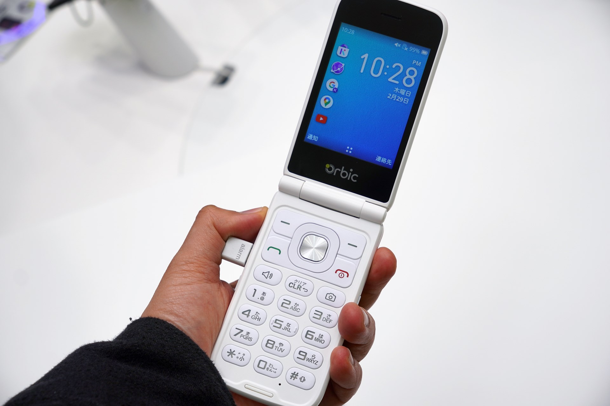

# Orbic Journey Pro 4G
{:.no_toc}
*First KaiOS 3 phone to be released outside the US, as the company makes strategic move to invest into the Japanese market*



*Photos provided by Impress Mobile Watch (Japan).*

Orbic, a New York-based electronic device manufacturer, gained recognition for its diverse product lineup catering to both consumer and business needs. Its offerings include wearables, mobile hotspots, phones and tablets. Together with Sunbeam, the company is widely known within the feature phone community for its affordable AOSP flip phone Journey V. It has a global presence with subsidiaries around the world, notably in Australia and Japan.

In a strategic move to invest further in the Japanese market, at MWC 2024 Orbic Japan showcased a range of upcoming products, of which included the Orbic Journey Pro 4G with KaiOS 3.1. Drawing design inspiration from the TCL Flip Pro, the phone is described as "a device aimed at people who mainly make calls and value voice communication" (Hitomi Shimada, business development manager at Orbic Japan). This marks the milestone as the first KaiOS 3 phone to be released outside the US.

*Fun fact: this device was certified by the Phoenix Testlab in Germany (cert no. 204-B00907) and the Wi-Fi Alliance on 11-12th December 2023, and approved by Japan's MIC on 4th January 2024.*

## See also
- [Orbic releases feature phone and opens local production base in Japan](https://k-tai.watch.impress.co.jp/docs/event/mwc2024/1572811.html) (Japanese), part of Impress Mobile Watch's MWC 2024 coverage
- [US Orbic to release KaiOS-equipped feature phone in Japan, O4F231 passes technical compliance](http://blogofmobile.com/article/165227) (Japanese)