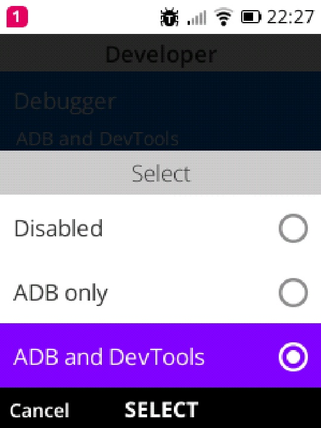
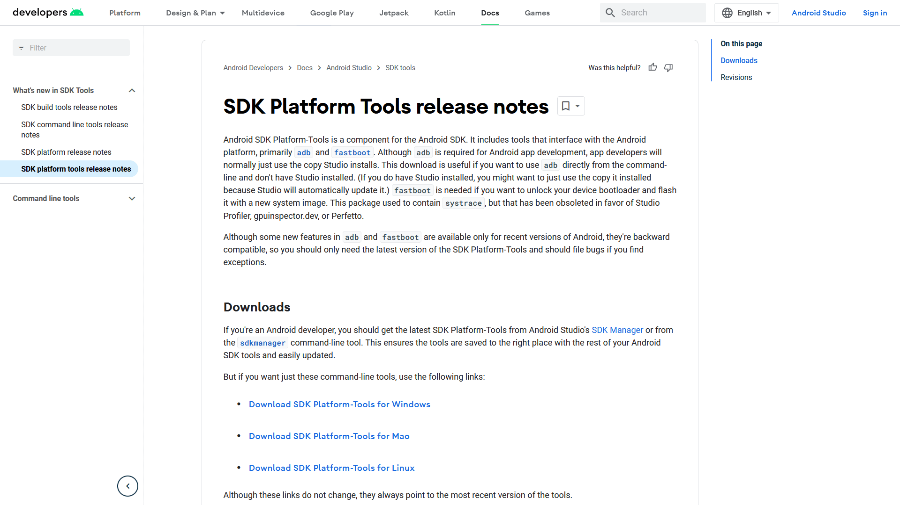
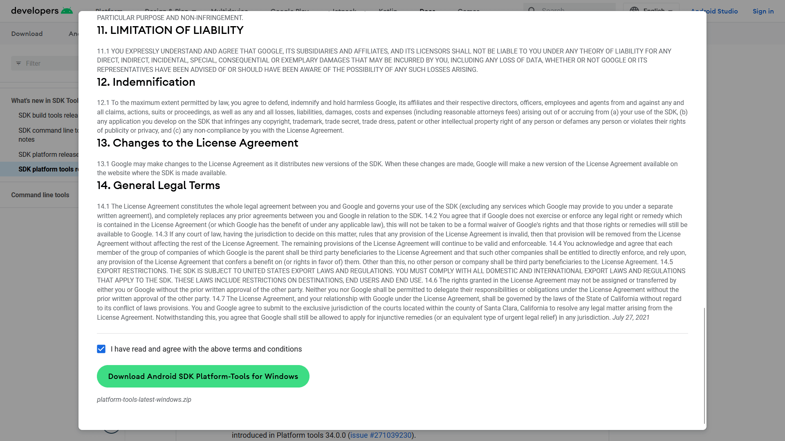
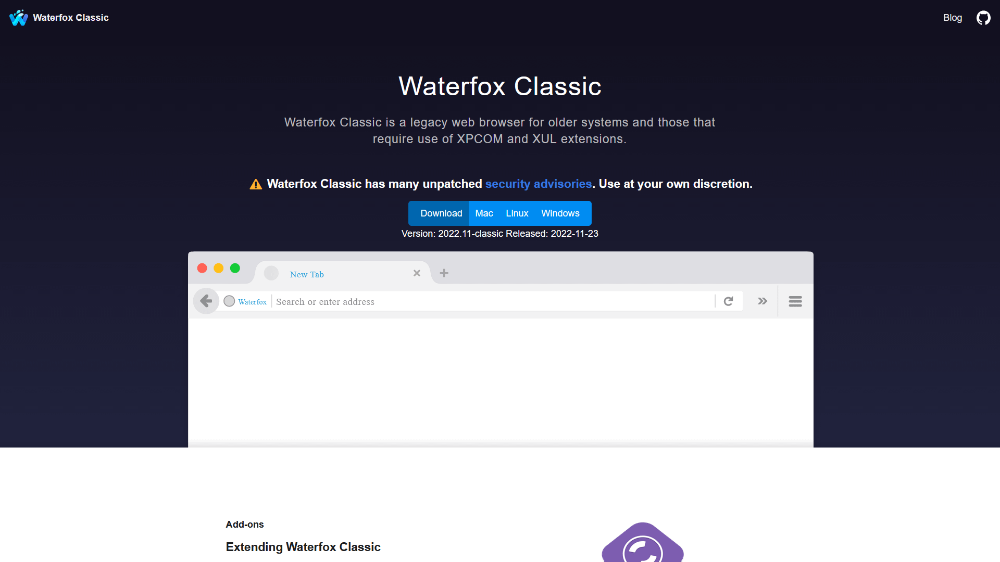
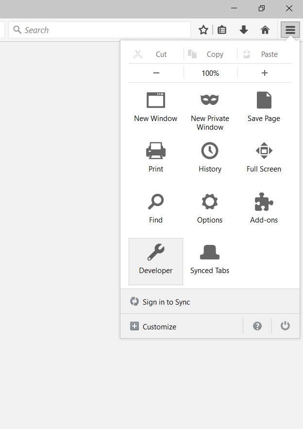
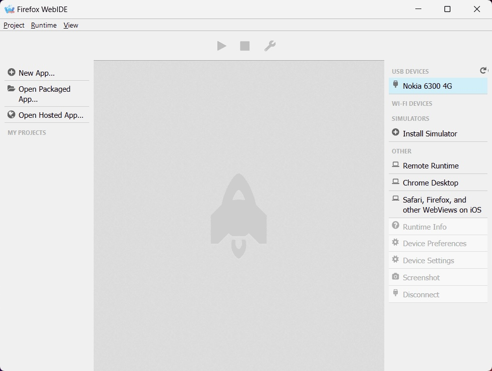
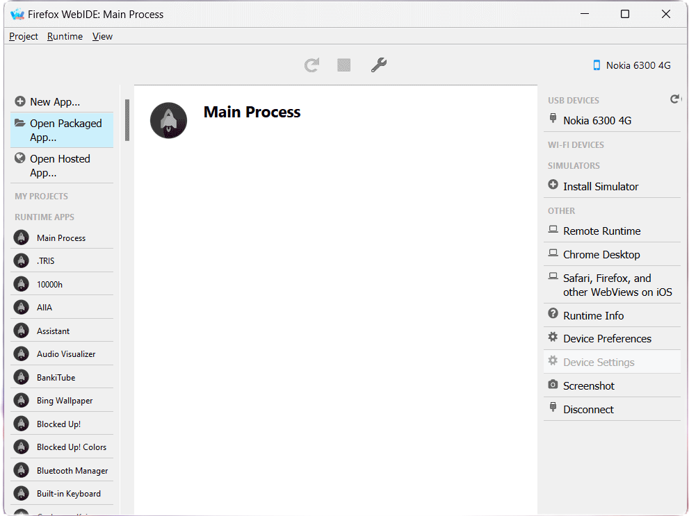
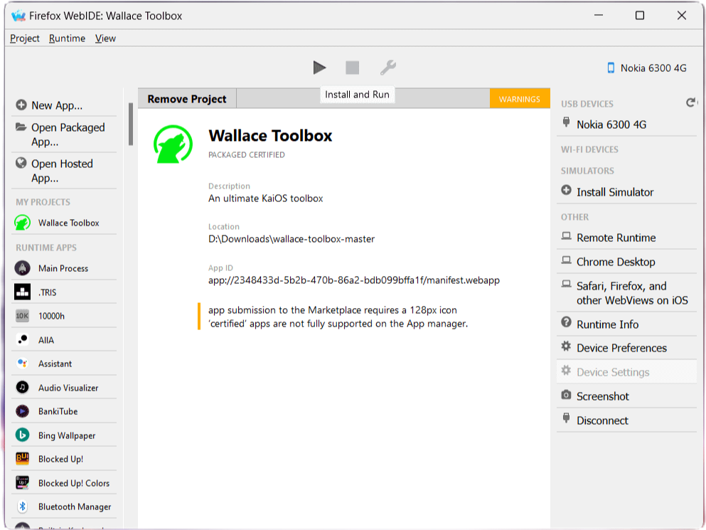

# ADB and WebIDE
{:.no_toc}

Table of Contents
{:.text-delta}
- TOC
{:toc}

## What we'll need
- a computer with built-in command-line tool ready: Command Prompt on Windows, Terminal on macOS/Linux
- a phone running KaiOS 2.5 (**KaiOS 3 users should not follow this guide**)
- an USB cable capable of data transferring
- an Internet connection for your phone to navigate to the W2D site (not needed if yours has a code to toggle debugging mode) and for your computer to read this guide (apparently) and download tools needed
- an archive extractor installed to extract our tools: Linux/macOS's built-in file manager, [7-Zip](https://www.7-zip.org) on Windows or, if you prefer, WinRAR

{:.warning}
> KaiOS 3 has a different mean of sideloading apps developed by KaiOS Technologies themselves called `appscmd` which can be used if your device allows to do so. Instructions for using the tool can be found on [their Developer Portal](https://developer.kaiostech.com/docs/sfp-3.0/getting-started/env-setup/os-env-setup).

## Sideloading 101
*Need a video tutorial? If you're on Linux, KaiOS Technologies officially made one for their own WebIDE client KaiOSRT which can be found [here](https://www.youtube.com/watch?v=wI-HW2cLrew). Alternatively, there's also one on BananaHackers' YouTube channel [here](https://www.youtube.com/watch?v=SoKD7IBTvM4).*

1. Check whether your phone can be debugged and if there are any special notes to follow in the [Devices page]().

*Some devices may have specific codes that can be dialed right from the home screen to quickly activate debugging mode, i.e. `*#*#33284#*#*` for Nokia devices, and both `*#*#33284#*#*` and `*#*#0574#*#*` for Energizers and some other devices. More details of this can be found on the [Devices page]().*

{:style="counter-reset:none"}
2. Open the phone's Browser and go to https://w2d.bananahackers.net. Use D-Pad keys to move the cursor and click on the big front `Launch Developer menu` button. 

3. In the newly opened Developer menu, select the first `Debugger` option, then select `ADB and DevTools` in the dropdown menu. You should see a bug icon in the status bar letting you know ~~your phone has bugs inside~~ you're in debugging mode.




{:style="counter-reset:none"}
4. Connect the phone to your computer with the USB cable.


If you're connecting to a Linux-based PC, you may need to go to Settings > Storage and turn on USB Storage for `udev` to properly register your phone as an USB peripheral. An icon in the status bar will appear indicating storage access via USB.

> Now, if your operating system has a package manager, you can utilize that to quickly install and set up ADB:
> * Windows: `choco install adb` 
> (`winget` unfortunately [prohibits installing executables with symlinks](https://github.com/microsoft/winget-pkgs/issues/4082))
> * macOS: `brew install android-platform-tools`
> * Linux (Debian/Ubuntu): `sudo apt-get install adb fastboot`
> * Linux (Fedora): `sudo dnf install android-tools`
> * Linux (Arch): `sudo pacman -S android-tools`
> 
> Skip to step 7 when you're done.

{:style="counter-reset:none"}
5. On your computer, visit [Android Developers' SDK Platform Tools website](https://developer.android.com/tools/releases/platform-tools) and click on the link correspond to your operating system under the Downloads section to download ADB to your computer. Read the terms if you want to, tick the box and click the green button to have the SDK downloaded to your computer.




{:style="counter-reset:none"}
6. Extract the downloaded archive to a folder (double-click the file on macOS, right-click and select *Extract here* on Linux, *7-Zip > Extract here* on Windows), navigate to its `platform-tools` root if needed and open a command-line window within that.

7. Type `adb devices` to start the ADB server. If a `device` shows, that means your phone is being detected by ADB and you're good to go, otherwise double-check.

Note that if you're unable to run `adb`, you may need to make it an executable: `chmod +x ./adb`
```
$ adb devices
* daemon not running; starting now at tcp:5037
* daemon started successfully
List of devices attached
1a2b3c4d	device
```
*Tip: If you've downloaded the SDK package from Android Developers' website, for quicker access next time, include the extracted ADB folder in PATH. We won't cover this here as this would be a lengthy process. This will be automatically handled if you've installed ADB via package manager.*

{:style="counter-reset:none"}
8. We'll use [Waterfox Classic](https://classic.waterfox.net) for WebIDE (Firefox v59, Pale Moon <28.6.1 and command-line tools will also do the job just fine, see below). To download, head to the browser's homepage, download and install the version correspond to your OS.



{:style="counter-reset:none"}
9. Open the browser and press the hamburger menu button at the top right of the toolbar, and click the Developer entry. Then click WebIDE to open it.




*Tip: For quicker access to WebIDE, press its shortcut `Shift` + `F8` while you're in the browser.*

{:style="counter-reset:none"}
10. Your phone's name should already appear in the right pane. Click it to connect and skip to step 12. If you don't see any, type this into the command-line window:
```
$ adb forward tcp:6000 localfilesystem:/data/local/debugger-socket
6000
```



{:style="counter-reset:none"}
11. In WebIDE, click Remote Runtime, leave it as default at `localhost:6000` and press OK. If you still cannot connect your phone to WebIDE, double-check if you missed any step.


If you're using other means to access WebIDE such as Firefox v59 or Pale Moon <28.6.1, you may now see a warning header about mismatched build date. You can safely ignore it as WebIDE was mainly designed to support Firefox OS device builds released alongside that Firefox/Pale Moon versions.

{:style="counter-reset:none"}
12. To sideload an app, download it and extract its ZIP content (if you see an OmniSD-packaged `application.zip` you may need to extract once more). Select Open Packaged Apps in WebIDE's left sidebar and navigate to the root of the app folder you just extracted.



{:style="counter-reset:none"}
13. Once you've got the app loaded, press the triangle Install and Run in the top bar to sideload!



> If you happen to encounter an issue in a sideload app and want to debug, click the wrench to open the Developer Tools.