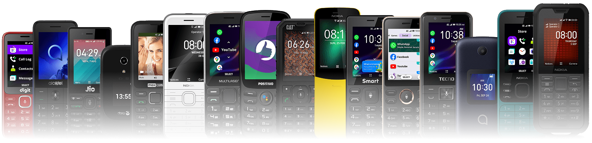

# Devices
{: .no_toc }

Table of Contents
{: .text-delta }
- TOC
{:toc}

## Quick reference table
- A green tick (✅) indicates that this device is debug-enabled out-of-box. To enable debugging mode, go to w2d.bananahackers.net on the device's Browser, click on *Launch Developer menu* and toggle *ADB and DevTools* under *Debugger*. Some devices also have a dedicated code for quick toggling debugging mode, with `*#*#33284#*#*` being the most common.
  - Check out the dedicated [Sideloading and debugging]() section for more information on methods of installing and debugging third-party apps.
- A warning symbol (⚠️) means that this device needs additional steps prior to activate debugging capability, such as editing some system files or at worst requiring permanent root access. Read the notes and the device's dedicated page for information and guides.
- A lock (🔒) means that this device is, sadly, currently unable to be debugged using most of the known methods. [Not all hope is lost, though.]()
- A question mark (❓) means that this device is untested. We cannot get our hands on all available KaiOS devices to test them out, and we need your help! If you want to contribute to this table, post your discoveries on [r/KaiOS subreddit](https://reddit.com/r/KaiOS), [BananaHackers Google Groups](https://groups.google.com/g/bananahackers) or hit me up on [GitHub](https://github.com/minhduc-bui1/wiki/issues/new/choose)!

*I'd like to thank the team at [PhoneCopy](https://www.phonecopy.com/en/phones/os/KaiOS) for collecting KaiOS phones' information and making this table possible! Not sponsored, but definitely check them out.*

| Model name | Version | Status | Note |
| :--------- | :------ | :----: | :--- |
| [Nokia 8110 4G] | **2.5.1 17.00.17.01** | ✅ |  |
| [Nokia 2720 Flip] | **2.5.2.2 40.00.17.02** | ⚠️ | Debug-enabled on 2.5.2, requires permanent root access via boot partition patching on 2.5.2.2 |
| [Nokia 800 Tough] | **2.5.2.2 40.00.17.01** | ⚠️ | Debug-enabled on 2.5.2, requires permanent root access via boot partition patching on 2.5.2.2 |
| [Nokia 8000 4G] | **2.5.4 20.00.17.01** | ✅ | No `engmode-extension` apps, requires boot partition patching to root |
| [Nokia 6300 4G] | **2.5.4 30.00.17.01** | ✅ | No `engmode-extension` apps, requires boot partition patching to root (excl. TA-1324 not rootable due to different PK_HASH ⇒ no substitute loader) |
| Nokia 2720 V Flip | **2.5.4 10.00.17.12** | 🔒 | Rooting procedures should be the same as 8000 4G/6300 4G, but phone rejects patched boot image |
| Nokia 2760 Flip | 3.1 | 🔒 | ADB reports as unauthorized |
| [Nokia 2780 Flip] | 3.1 | ⚠️ | Custom firmware & [manual injection] to sideload, no debugging. [ADB reports as unauthorized] |
| [CAT B35] | 2.5.1 | ⚠️ | Requires extracting using EDL and editing ADB hex on data partition |
| Doro 7050 | 2.5 | ⚠️ | No KaiStore. Power + Vol- to boot into FFBM, 'adb shell start b2g', use W2D to turn on debugging mode. Wallace Toolbox for permanent dev menu |
| [Doro 7060/7070] | 2.5.1 | ⚠️ | No KaiStore. Power + Vol- to boot into FFBM, 'adb shell start b2g', use W2D to turn on debugging mode. Wallace Toolbox for permanent dev menu |
| Energizer E241 | 2.5.1.1 | ❓ |  |
| Energizer E241s | **2.5.1.2 2.5.3.2** | ✅ | *there appears to be two revisions of this phone?* |
| Energizer E242s | **2.5.3.2** | 🔒 | *Credits to u/CaramelSpoonful on Reddit for confirming* |
| Energizer E280s | **2.5.3.2** | ✅ | *Credits to u/gogolplex-pt on Reddit for confirming* |
| Energizer E282sc | **2.5.3.2** | 🔒 | *Credits to u/nicalejo on Reddit for confirming* |
| Energizer H280s | 2.5.1.1 **2.5.3.2** | ❓ | *there appears to be two revisions of this phone?* |
| Alcatel 3078 3G | 2.5.1.1 | ❓ |  |
| Alcatel 3088X | 2.5.1.1 | ✅ | W2D for debug mode |
| Alcatel Go Flip 1/2 (4044v) | 1.0 | ✅ | After turning on debugging mode, dial `##3424#` to enable serial port |
| [Alcatel Go Flip 3/ Alcatel SMARTFLIP] | 2.5.2 | ⚠️ | Requires permanent root access by patching the boot partition |
| Alcatel Go Flip 4 (4056w) | 3.0 | 🔒 | ADB reports as `unauthorized` *Credits to u/tbrrss on Reddit for confirming* |
| Alcatel MyFlip (A405DL) | 2.5.x | ⚠️ | Requires extracting using EDL and editing ADB hex on data partition |
| Alcatel MyFlip 2 (A406DL) | **2.5.4** | ✅ | No `engmode-extension` apps, no rooting |
| AT&T Cingular Flip IV/ Cricket Debut Flip | **2.5.3.1** | ✅ | No rooting (confirmed on 2.5.3) |
| AT&T Cingular Flex | **2.5.4** | ✅ | No `engmode-extension` apps, no rooting |
| AT&T Cingular Flex 2/ Cricket Debut Flex | 3.1 | 🔒 | ADB reports as `unauthorized` *Credits to u/canyouswim73 on Reddit for confirming* |
| TCL Flip Pro | 3.0 | 🔒 | ADB fails to detect device |
| IRIS Flip | 3.1 | 🔒 | First phone with eSIM support and 1GB of RAM. To enable ADB access, dial `*#*#9527#*#*`. DevTools is restricted for now |
| myPhone Up Smart 3G | 2.5.1.1 | ❓ |  |
| myPhone Up Smart LTE | **2.5.3.1** | 🔒 | ADB reports as `unauthorized` |
| Crosscall Core-S4 | **2.5.3.2** | ✅ | No engmode-extension apps |
| Maxcom MK241 | 2.5.1 | ❓ |  |
| Maxcom MK281 | 2.5.1.1 | ✅ |  |
| Accent Nubia 50K | 2.5.1.1 | ❓ |  |
| Accent Nubia 60K | 2.5.1.1 | ❓ |  |
| Jazz Digit 4G | **2.5.3.1** | ❓ |  |
| MTN Smart 3G | **2.5.1.2** | ❓ |  |
| Multilaser/ObaPhone ZAPP | 2.5.1.1 | ✅ |  |
| Multilaser ZAPP II 3G | **2.5.1.2** | ✅ |  |
| TTfone TT240 | 2.5.1.1 | ✅ |  |
| BKAV C85 | 2.5.1.1 | ❓ | Imported from China and sold in Vietnam with limited quantity. If you have this phone, contact #device-dev on our Discord server. |
| Viettel V6504 | **2.5.3.2** | ❓ | Press and hold 2 on boot to enter Recovery mode |
| Itel it9200 4G | **2.5.1.2** | ❓ |  |
| Itel it9300 | 2.5.1.1 | ❓ |  |

## Regarding KaiOS 3 on older devices

## WhatsApp voice calls on KaiOS (WAVoIP)

[Nokia 8110 4G]: 
[Nokia 2720 Flip]: 
[Nokia 800 Tough]: 
[Nokia 8000 4G]: 
[Nokia 6300 4G]: https://minhduc-bui1.github.io/nokia-leo
[Nokia 2780 Flip]: 
[CAT B35]: 
[Doro 7060/7070]: 
[Alcatel Go Flip 3/ Alcatel SMARTFLIP]: 

[manual injection]: https://git.abscue.de/affe_null/weeknd-toolbox
[ADB reports as unauthorized]: https://discord.com/channels/472006912846594048/472006912846594050/1097387870123208754